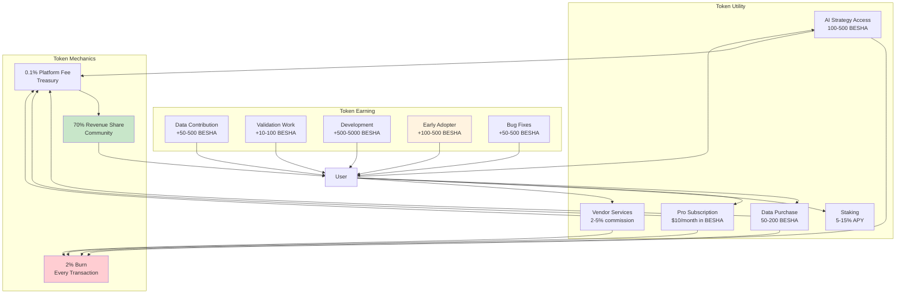

# Introducing BESHA: Your Reputation is Your Currency

## Executive Summary

BESHA is a revolutionary financial ecosystem token where your reputation matters more than your bank balance, and your contributions earn you real, tangible rewards.

Built on the Ethereum blockchain as an ERC20 token, BESHA powers FinDash Buddy, a comprehensive platform that combines AI-powered trading tools, decentralized data markets, peer-to-peer transactions, and community governance. Unlike speculative tokens that promise vague utility, every BESHA transaction serves a real purpose: paying for AI trading insights, rewarding data contributors, compensating validators, enabling peer-to-peer money transfers, and distributing platform revenues back to the community.

**What makes BESHA unique?** Three fundamental principles:

1. **Reputation-First Economy**: Your on-chain reputation determines your opportunities, not your wallet size. Bad actors are publicly identified and restricted, while good contributors gain access to higher rewards and responsibilities.

2. **Real Utility from Day One**: BESHA has built-in demand as the *only* currency for trading strategies, data access, validator services, ISP node operations, and in-platform transactions. Demand is built into the system's DNA.

3. **Community Ownership**: 70% of platform revenues flow back to token holders through staking rewards, validator earnings, ISP node income, and direct profit sharing. This is a guaranteed commitment coded directly into the smart contracts.

For investors, BESHA offers multiple revenue streams: staking yields of 5-15% APY, validator fees from dispute resolution, ISP node earnings from network operations, revenue sharing from platform growth, and deflationary appreciation through a 2% burn on every transaction. You're buying ownership in a self-sustaining economic ecosystem with real utility and revenue generation.

---

## The Problem: Traditional Finance Meets Crypto's Reality Check

### Three Broken Systems

**1. The Trading Industry's Information Asymmetry**  
Professional traders have access to institutional-grade tools, real-time data feeds, and algorithmic strategies that cost thousands per month. Retail traders are left with free charting tools and hope. This isn't a level playing field—it's a casino where the house has marked cards. AI-powered trading tools exist, but they're locked behind enterprise paywalls or are too complex for everyday users.

**2. Crypto's Trust Problem**  
Cryptocurrency promised decentralization, but most platforms still operate like banks: centralized control, opaque fee structures, no recourse for disputes, and zero accountability. When something goes wrong—and it often does—users have no protection. Scammers create new accounts after being caught, validators have no skin in the game, and reputation systems are either non-existent or easily gamed.

**3. The Remittance Trap**  
Sending money across borders—or even within developing nations—costs 7-15% in fees through traditional remittance services. Crypto promised to fix this, but without local withdrawal agents and trust mechanisms, it remains unusable for most of the world's population. A migrant worker in Dubai sending money home to Kenya shouldn't lose $50 on a $500 transfer.

### The Real Gap

No platform has successfully combined:
- Professional-grade AI trading tools accessible to everyone
- A transparent, permanent reputation system that follows users forever
- Multiple ways to earn based on actual value contribution
- Low-cost peer-to-peer transactions with local currency withdrawal
- Community governance with real economic stakes

That's where BESHA comes in.

---

## Our Solution: BESHA—The Currency That Rewards Value Creation

### What Is BESHA?

BESHA is an ERC20 token (meaning it follows Ethereum's standard for *fungible tokens*—each BESHA is identical and interchangeable, like dollars or euros) that powers every transaction in the FinDash Buddy ecosystem. Think of it as the oil that makes the machine run, except this oil appreciates in value as the machine gets bigger.

**The Core Innovation**: BESHA ties economic value directly to reputation and utility. You can't just "buy your way in"—you have to earn trust through consistent, valuable contributions. And unlike traditional platforms where the company takes 90% of revenues, FinDash Buddy returns 70% to the community. Why? Because *you* are the platform.

### How It Works: A Day in the BESHA Ecosystem

**Morning: Trading with AI**  
Maria, a trader in Mexico City, pays 100 BESHA to access an AI-generated trading strategy that analyzes 50+ technical indicators in real-time. The strategy developer earns 80 BESHA, the platform takes 1 BESHA (1% fee), and 2 BESHA (2%) are *burned*—permanently removed from circulation, making everyone's BESHA slightly more scarce and valuable.

**Afternoon: Contributing Data**  
James in London uploads a curated dataset of cryptocurrency exchange OHLCV (Open, High, Low, Close, Volume—*the basic price data used in trading charts*) data. After three validators review and approve its accuracy, James earns 150 BESHA. Each validator earns 10 BESHA for their work. The data is now available for AI models to consume, improving the entire platform's intelligence.

**Evening: Validating a Dispute**  
Aisha in Nairobi, a trusted validator with an 85 reputation score, reviews a transaction dispute between two users. She examines the evidence, votes based on the facts, and if she's in the majority, earns 5% of the disputed transaction value (capped at practical amounts). If she's wrong, she loses reputation points. This *stakes her credibility*—she has to be right or face consequences.

**Night: Passive Income**  
David in California has 10,000 BESHA staked in the platform. He does nothing, and overnight his stake earns 0.04% (translating to roughly 12% APY). He also runs an ISP node that routes 2 million packets, earning him an additional 2,000 BESHA that month. His reputation score of 92 gives him a 20% bonus on all earnings.

**The Result**: Five people across four continents, all earning BESHA through different activities, all contributing to a self-sustaining ecosystem. No central company extracting value—just a community creating and sharing wealth.

---

## Vision & Mission: Building the People's Financial Infrastructure

### Our Vision (Where We're Going)

**"A world where anyone, anywhere can access professional financial tools, earn based on their contributions, and transact freely without permission from banks, governments, or corporations."**

We envision a future where:
- A farmer in rural India can use AI to hedge crop prices using crypto derivatives
- A student in Brazil can earn income validating data while studying
- A developer in Nigeria can contribute code and earn a stake in the platform's success
- A retiree in Japan can generate passive income through staking without technical knowledge
- Financial borders disappear, and value flows freely based on merit, not geography

### Our Mission (What We're Doing Now)

**"To create a decentralized, community-owned platform that democratizes access to financial tools, rewards value creation, and protects participants through transparent reputation systems."**

Three pillars guide everything we build:

**1. Accessibility**: Professional-grade AI trading tools shouldn't cost $10,000/month. They should be available for micro-payments that anyone can afford. Financial intelligence should be a public good, not a luxury.

**2. Meritocracy**: Your earning potential is determined by the value you create and your reputation score, not your initial capital. A validator with a 95 reputation score earns more than one with a 65 score—because trust is the most valuable currency.

**3. Transparency**: Every transaction, every reputation change, every governance vote is recorded permanently on the blockchain. You can verify *everything*. No hidden fees, no backroom deals, no "terms and conditions" that change overnight.

### Core Values (How We Operate)

- **Community First**: 70% revenue sharing isn't charity—it's recognition that users *are* the platform
- **Reputation Permanence**: Bad actors can't escape their history by creating new accounts
- **Real Utility**: Every token has a purpose; speculation is a side effect, not the goal
- **Open Development**: Code is open-source; anyone can audit, contribute, or fork
- **Security by Design**: Escrow, multi-tier disputes, validator stakes—protection is mandatory, not optional

---

## Technical Architecture: How BESHA Actually Works

### The Foundation: ERC20 with Purpose

BESHA is built on the ERC20 standard, which means it's compatible with every Ethereum wallet (MetaMask, Ledger, Trezor, etc.), every decentralized exchange (Uniswap, SushiSwap), and every DeFi (*Decentralized Finance—financial applications that run on blockchain without banks*) protocol. But it's not just a basic ERC20 token—it's been enhanced with specific features for the FinDash Buddy ecosystem.

**Key Technical Specifications:**
- **Token Standard**: ERC20 (Ethereum blockchain)
- **Decimals**: 18 (standard for ERC20, allowing for micro-transactions)
- **Supply Model**: Deflationary (more on this below)
- **Contract Security**: Multi-signature requirements for critical functions
- **Upgrade Path**: Proxy pattern for future improvements without disrupting users

### The Economic Engine: Deflationary by Design

Every BESHA transaction automatically executes three actions:

1. **Platform Fee (0.1%)**: Goes to a community treasury that funds development, marketing, and ecosystem growth
2. **Burn (2%)**: Permanently destroys tokens, reducing total supply
3. **Transfer**: Sends the remaining 97.9% to the recipient

**Example**: You send 1,000 BESHA
- Platform receives: 1 BESHA
- Burned forever: 20 BESHA  
- Recipient gets: 979 BESHA

**Why This Matters**: If FinDash Buddy processes $1 million in daily transactions (which equals 1 million BESHA at $1/token), that's 20,000 BESHA burned *every day*. Over a year, that's 7.3 million BESHA removed from circulation. As supply decreases and demand grows, basic economics kicks in: *price goes up*.

### Smart Contract Architecture: Security Meets Flexibility

**Three-Layer Security Model:**

1. **Escrow Layer**: High-value transactions lock funds until conditions are met
   - Withdrawal agent transactions hold BESHA until recipient confirms cash delivery
   - Large trades can require multi-party approval
   - Automatic refunds if conditions aren't met within time limits

2. **Validation Layer**: Community review for critical actions
   - Data submissions reviewed by 3+ validators before rewards are paid
   - Dispute resolution requires 2/3 majority vote
   - Wrong votes cost validators reputation points

3. **Governance Layer**: Token holders control platform evolution
   - Major changes require DAO (*Decentralized Autonomous Organization—a community that makes decisions through token-holder voting*) vote
   - Treasury spending above thresholds needs community approval
   - Emergency pause functions protect against exploits

**Gas Optimization**: Contracts are optimized to minimize Ethereum transaction fees. Batch operations where possible, efficient data structures, and minimal storage writes keep costs low for users.

### Integration Points: BESHA's Universal Utility

The token flows through multiple systems creating a comprehensive economic ecosystem:

### BESHA Token Economy Flow

This diagram shows the complete token flow: how users spend BESHA (top), how they earn it (middle), and how the deflationary mechanics work (bottom).

**AI Trading Module**:
- Pay per strategy access
- Subscribe to AI signals
- Purchase backtested models

**Data Marketplace**:
- Buy OHLCV data feeds
- Access news sentiment analysis
- Purchase economic indicators

**Peer-to-Peer Transfers**:
- Send to any wallet address or username
- Low-cost cross-border transactions
- Escrow protection available

**Validator Network**:
- Stake 100 BESHA to become a validator
- Earn fees from dispute resolution
- Reputation-weighted rewards

**ISP Node Operations**:
- Stake 10,000 BESHA to run a node
- Earn per packet routed and GB transferred
- Uptime bonuses for reliable nodes

**Governance Participation**:
- One token = one vote on proposals
- Submit proposals (reputation requirements apply)
- Vote on treasury allocations

---

## Tokenomics: The Economic Engine Explained

### Supply & Distribution: Where Every BESHA Comes From

**Initial Supply Model** (based on typical ERC20 best practices):
- **Community Rewards Pool (40%)**: Distributed over 4 years through staking, validation, data contributions, node operations
- **Team & Development (20%)**: Vested over 3 years with 1-year cliff (meaning *tokens unlock gradually to prevent team dumping*)
- **Ecosystem Fund (15%)**: Partnerships, grants, strategic initiatives
- **Liquidity Provision (10%)**: DEX liquidity for trading
- **Early Supporters (10%)**: Pre-launch contributors and testers
- **Treasury Reserve (5%)**: Emergency fund and platform operations

**Vesting Schedules Prevent Dumps**: Team and early supporter tokens unlock slowly (e.g., 2% per month after a 12-month wait), ensuring long-term alignment with platform success.

### Fee Structure: Lower Than Anywhere Else

Compare BESHA to alternatives:

| Platform | Transaction Fee | Burn Rate | Total Cost | Your Benefit |
|----------|----------------|-----------|------------|--------------|
| **BESHA (FinDash)** | 0.1% | 2% | **2.1%** | Deflationary + Revenue Share |
| Traditional Remittance | 7-15% | 0% | 7-15% | Nothing |
| Credit Card Processing | 2.5-3.5% | 0% | 2.5-3.5% | Nothing |
| Typical DEX Swap | 0.3-1% | 0% | 0.3-1% + gas | Nothing |

**Real Transaction Example:**

Maria sends 10,000 BESHA to pay for a trading strategy:
- **Platform Fee**: 10 BESHA (0.1%) → Goes to treasury for platform maintenance
- **Burn**: 200 BESHA (2%) → Permanently removed, makes remaining BESHA more valuable
- **Developer Receives**: 9,790 BESHA (97.9%) → Can use, stake, or withdraw

**Why 2.1% Total Matters**: On a $1,000 transaction:
- BESHA cost: $21
- Bank wire: $70-150
- Western Union: $70-120
- PayPal (international): $45-60

You save $50-130 *per transaction* while also contributing to token scarcity.

### Burn Mechanics: Creating Scarcity at Scale

**The Math of Deflation:**

Assume conservative adoption:
- 100,000 active users
- Average 10 transactions per month per user
- Average transaction size: 100 BESHA

**Monthly Calculations:**
- Total transactions: 100,000 users × 10 transactions = 1,000,000 transactions
- Total volume: 1,000,000 transactions × 100 BESHA = 100,000,000 BESHA
- **Total burned: 100,000,000 BESHA × 2% = 2,000,000 BESHA per month**

**Annual Impact**: 24 million BESHA burned per year. If initial supply is 500 million, that's 4.8% supply reduction annually from burns alone.

**The Investor Angle**: As supply decreases and platform usage grows, each BESHA you hold represents a larger share of the ecosystem. It's like owning stock in a company doing buybacks—except the "buyback" is automatic and permanent.

### Staking Rewards: Passive Income Explained

**Three Staking Tiers:**

**Bronze Tier** (100-999 BESHA):
- Lock-up: 3 months
- APY: 5-7%
- Bonus Features: Priority support
- **Example**: Stake 500 BESHA for 3 months → Earn 6.25-8.75 BESHA

**Silver Tier** (1,000-9,999 BESHA):
- Lock-up: 6 months
- APY: 8-12%
- Bonus Features: Early feature access, reduced fees
- **Example**: Stake 5,000 BESHA for 6 months → Earn 200-300 BESHA

**Gold Tier** (10,000+ BESHA):
- Lock-up: 12 months
- APY: 12-15%
- Bonus Features: Governance voting weight, ISP node eligibility, revenue share
- **Example**: Stake 50,000 BESHA for 12 months → Earn 6,000-7,500 BESHA

**Where Rewards Come From:**
- Platform transaction fees (0.1%)
- Revenue sharing (15% of monthly profits distributed to stakers)
- Validator penalties (slashed stakes redistributed)
- ISP node registration fees

### Validator Economics: Earn While You Protect

**Requirements:**
- Stake: 100 BESHA (refundable)
- Reputation: 60+ (earned through consistent good behavior)
- Availability: Respond to cases within 48 hours

**Earnings Breakdown:**

**Data Validation:**
- Review dataset submissions: 10-50 BESHA per review
- Accuracy determines payout (high-quality data = higher reward)
- Bonus: +5 reputation for correct votes

**Dispute Resolution:**

- **Dynamic Reward**: Maximum of 5% of disputed transaction OR 5 BESHA (whichever is greater)
- *Example 1*: $50 transaction disputed → 5% = $2.50 (but minimum is $5, so you earn 5 BESHA)
- *Example 2*: $10,000 transaction disputed → 5% = $500 (you earn 500 BESHA)
- **Treasury Subsidy**: If 5% is less than 5 BESHA, treasury covers the difference to ensure validators are always fairly compensated

**Content Moderation:**
- Flag spam/abuse: 5-20 BESHA per action
- Approve community contributions: 5-15 BESHA

**Monthly Validator Income (Conservative Estimate):**
- 30 data validations × 15 BESHA average = 450 BESHA
- 10 disputes × 50 BESHA average = 500 BESHA
- 20 content moderations × 10 BESHA average = 200 BESHA
- **Total: ~1,150 BESHA/month (~$1,150 at $1/token)**

**Plus**: Your 100 BESHA stake earns 5-7% APY (an additional 0.5-0.6 BESHA/month).

### Revenue Sharing: Ownership Without Shares

**The 70/30 Split:**
- **70% to Community**: Stakers, validators, contributors, node operators
- **30% to Platform**: Development, marketing, operations

**How It Works:**

Imagine FinDash Buddy generates $1,000,000 in monthly revenue from:
- AI strategy subscriptions
- Data marketplace fees
- Premium features
- Advertisement (minimal, non-intrusive)

**Distribution:**
- **Community Pool**: $700,000 (70%)
  - Stakers: $455,000 (65% of community pool)
  - Validators: $140,000 (20% of community pool)
  - ISP Nodes: $105,000 (15% of community pool)

- **Platform Operations**: $300,000 (30%)
  - Development: $150,000
  - Marketing: $90,000
  - Operations: $60,000

**Your Share as a Staker:**

If you stake 10,000 BESHA and total staked is 100,000,000 BESHA:
- Your share: 10,000 / 100,000,000 = 0.01%
- Monthly revenue share: $455,000 × 0.01% = $45.50
- **Plus** your base staking APY
- **Plus** any validator or node operator income

**The Compounding Effect**: Reinvest your monthly distributions back into staking, and your share grows. Over a year, this compounds significantly.

---

## Ecosystem Utility: Every Way BESHA Is Used

### 1. Trading & AI Strategy Access

**Use Case**: Access professional-grade trading tools without $10,000/month subscriptions.

**How It Works:**
- Browse strategy marketplace
- Preview backtest results (free)
- Pay 50-500 BESHA to unlock full strategy
- Developer earns 80-95%, platform takes 5-20%, 2% burned

**Real Example:**
- "RSI + MACD + Volume Confirmation" strategy: 200 BESHA
- Backtest shows 67% win rate over 2 years
- You pay 200 BESHA, gain access to real-time signals
- Developer (who spent 40 hours building this) earns 196 BESHA per sale

**Benefit**: Strategies are peer-reviewed and rated by other traders. Bad strategies get downvoted, good ones rise. Meritocracy in action.

### 2. Data Marketplace

**Use Case**: Earn by contributing data, or purchase data for your own models.

**Data Types Accepted:**
- OHLCV (price data from exchanges)
- News articles with sentiment scores
- Economic indicators
- Social media sentiment
- On-chain metrics

**Contributor Earnings:**
- OHLCV dataset (1 year, 15 assets): 150-200 BESHA
- News article with analysis: 20-100 BESHA
- Trading signal (with performance proof): 100-500 BESHA
- **Quality Bonus**: +50% for exceptionally accurate/useful data

**Data Buyer Benefits:**
- Pay per dataset (no subscriptions)
- Preview data quality scores
- Verified by community validators
- Instant access after payment

### 3. Peer-to-Peer Transactions

**Use Case**: Send money to anyone, anywhere, for 2.1% total cost.

**Scenarios:**

**International Remittance:**
- Worker in Dubai → Family in Kenya
- Send 10,000 BESHA (equivalent to $10,000)
- Cost: 210 BESHA ($210)
- Traditional wire: $700-1,000
- **Savings: $500-800**

**Freelancer Payment:**
- Client in US → Developer in Philippines
- Send 5,000 BESHA for project completion
- Cost: 105 BESHA ($105)
- PayPal International: $250-300
- **Savings: $145-195**

**Peer Lending:**
- Friend lends 1,000 BESHA
- Escrow smart contract holds funds
- Automatic repayment with 5% interest
- Dispute resolution if needed

### 4. Withdrawal Agent Network

**Use Case**: Cash out BESHA to local currency without centralized exchanges.

**The Process:**

1. **Find Agent**: Filter by location, rating (1-5 stars), reputation score (aim for 70+), commission (1-5%)
2. **Initiate Withdrawal**: Lock 1,000 BESHA in escrow
3. **Meet/Transfer**: In-person cash or mobile money (M-Pesa, Airtel Money)
4. **Confirm**: Release BESHA to agent, both parties rate each other
5. **Safety**: Escrow protects you; if agent doesn't deliver, dispute and get refund

**Agent Economics:**

Agents stake 1,000 BESHA minimum as collateral. If they scam users:
- Stake is slashed (they lose their 1,000 BESHA)
- Reputation drops to 0 (publicly branded as untrustworthy)
- Cannot create new accounts (identity verification prevents this)

**Agents earn**: 2-5% commission on withdrawals, building reputation to attract more clients.

### 5. ISP Node Operations

**Use Case**: Earn passive income by routing network traffic.

**Requirements:**
- Stake: 10,000 BESHA
- Internet: 10+ Mbps stable
- Hardware: Linux server (VPS or dedicated)
- Uptime: 95%+ target

**Earnings Formula:**
- **Packet Routing**: 0.001 BESHA per packet
- **Bandwidth**: 0.0001 BESHA per GB
- **Uptime Bonus**: 2× multiplier for 95%+ uptime

**Monthly Examples:**

**Low Traffic Node:**
- 500,000 packets = 500 BESHA
- 100 GB bandwidth = 10 BESHA
- Base: 510 BESHA
- With 95% uptime (2× bonus): **1,020 BESHA/month**

**Medium Traffic Node:**
- 2,000,000 packets = 2,000 BESHA
- 500 GB bandwidth = 50 BESHA
- Base: 2,050 BESHA
- With 98% uptime (2× bonus): **4,100 BESHA/month**

**High Traffic Node:**
- 5,000,000 packets = 5,000 BESHA
- 1,000 GB bandwidth = 100 BESHA
- Base: 5,100 BESHA
- With 99% uptime (2× bonus): **10,200 BESHA/month**

**Reputation Multiplier:**
- Reputation 80-89: +10% earnings
- Reputation 90-95: +20% earnings
- Reputation 96-100: +30% earnings

**Best Case** (High traffic + 95 reputation):
- Base: 10,200 BESHA
- Reputation bonus (+20%): 2,040 BESHA
- **Total: 12,240 BESHA/month (~$12,240 at $1/token)**

**ROI Calculation:**
- Initial stake: 10,000 BESHA
- Monthly earnings: 10,200 BESHA (conservative)
- **Payback period: ~1 month**
- All subsequent months: pure profit

### 6. Governance Participation

**Use Case**: Shape the platform's future and earn rewards for engagement.

**Voting Rights:**
- One BESHA = one vote
- Vote on proposals: fee changes, feature additions, treasury spending
- Voting rewards: 0.1-1 BESHA per vote (prevents voter apathy)

**Proposal Submission:**
- Requirements: 1,000 BESHA + reputation 70+
- Prevents spam while allowing meaningful input
- Community reviews proposals before voting

**Treasury Governance:**
- Approve spending above 100,000 BESHA
- Allocate ecosystem fund
- Emergency actions (e.g., pause contracts if exploit detected)

---

## 7. Dumo: The Social Finance Super-App

**The Missing Link**: While FinDash Buddy provides professional desktop tools for traders, **Dumo** puts the power of BESHA in everyone's pocket. It is a mobile-first social finance ("SocialFi") application designed to digitize informal cooperative savings groups (known as **Chamas** in East Africa, **Tandas** in Latin America, or **Susus** in West Africa).

### Key Features Powered by BESHA:

#### 1. Decentralized Chamas (Group Savings)
**The Problem**: Traditional informal savings groups rely on cash and trust. If the treasurer runs away, everyone loses.
**The Dumo Solution**:
- Create a "Contribution Group" in seconds
- Set contribution rules (e.g., 50 BESHA monthly)
- **Smart Contract Automation**: BESHA is automatically deducted from members' wallets
- **Transparent Treasury**: Funds are held in escrow, visible to all members
- **Payouts**: Rotational or goal-based distributions are executed by code, not people

#### 2. Dumo Super Market & "My Shop"
**Use Case**: Turning everyone into an entrepreneur.

**The Super Market**:
- **Local & Digital**: Buy groceries from a neighbor or digital art from a creator in Japan.
- **Services Hub**: Hire local transport, delivery, or logistics services paying directly in BESHA.
- **Verified Shops**: Shops have reputation scores, so you know who to trust before you buy.

**"My Shop" Feature**:
- **Business in a Box**: Open your own store in minutes.
- **No Setup Fees**: Just list your products or services.
- **Direct crypto payments**: Receive BESHA directly to your wallet, no card terminals needed.

#### 3. Dumo Magazine
**Use Case**: Free financial education in your pocket.
- **Stay Informed**: Read the latest on crypto, finance, and platform updates.
- **Learn to Earn**: Educational content to help you understand how to maximize your BESHA earnings.
- **Community Stories**: Read success stories from other members of the Dumo ecosystem.

#### 4. Chat-Based Payments
**Use Case**: Making money as easy as sending a text.
- Integrated chat interface allows you to send BESHA directly within conversations
- "Attach Money" just like you attach a photo
- Request funds from friends or group members with a single tap

#### 4. Reputation Profiles
**Use Case**: Your financial passport.
- View your live Reputation Score
- Display badges (e.g., "Top Contributor", "Early Adopter")
- Track earnings from staking, validation, and marketplace sales

**Dumo represents the consumer adoption layer of BESHA**, moving it beyond complex trading tools into everyday social interaction and community savings.

---

## Value Proposition for Investors: Why BESHA Appreciates

### 1. Built-In Scarcity (Deflationary Economics)

**The Mechanism:**
- 2% of every transaction burned permanently
- As platform grows, burn rate accelerates
- Supply decreases while demand increases

**Historical Precedent:**
- Bitcoin: Finite supply (21M) drives scarcity premium
- Binance Coin (BNB): Quarterly burns correlate with price increases
- Ethereum (ETH): EIP-1559 burns reduced supply, price increased 400% in following year

**BESHA's Advantage**: Burns happen *automatically* on every transaction, not quarterly. Real-time deflationary pressure.

### 2. Multiple Income Streams

Unlike most crypto where you "hold and hope," BESHA holders earn actively:

**Passive Income:**
- Staking: 5-15% APY (risk-free, just lock tokens)
- Revenue sharing: 15% of platform profits distributed monthly
- Governance rewards: Earn for voting on proposals

**Active Income:**
- Validator: ~1,150 BESHA/month
- ISP Node: 1,020-12,240 BESHA/month
- Data contributor: 50-500 BESHA per dataset
- Strategy developer: 100-1,000 BESHA per sale
- Content creator: 50-500 BESHA per post
- Referrals: 10% of referee earnings

**Total Potential (Conservative):**
- Staking 10,000 BESHA at 10% APY: 83 BESHA/month
- Validator (part-time): 500 BESHA/month
- Revenue share (0.01% of pool): 45 BESHA/month
- **Total: ~628 BESHA/month (~$628)**

### 3. Real Utility = Real Demand

**The Problem With Most Tokens:** They're speculative—value is based on hype, not usage.

**BESHA Is Different:**
- *Need* AI trading tools? Must buy BESHA.
- *Need* to validate data? Must stake BESHA.
- *Need* to run ISP node? Must stake BESHA.
- *Want* governance rights? Must hold BESHA.

**Demand Drivers:**
1. **Platform Growth**: More users = more transactions = more burns + more revenue
2. **AI Adoption**: As AI trading grows, strategy demand increases
3. **Data Economy**: Billions of dollars in market data—BESHA is the currency
4. **Geographic Expansion**: Each new country adds withdrawal agents + ISP nodes
5. **DeFi Integration**: BESHA collateral, liquidity pools, lending protocols

**Network Effects**: As more people join, the platform becomes more valuable, attracting more users, increasing demand for BESHA, driving price up, attracting more users—a virtuous cycle.

### 4. Competitive Moat

**Why BESHA Isn't Easy to Replicate:**

1. **Reputation System**: Permanent, on-chain, and public—can't be gamed
2. **Community Ownership**: 70% revenue share creates loyal user base
3. **Multi-Sided Platform**: Traders, developers, validators, data providers, node operators—each group strengthens the others
4. **First-Mover Advantage**: Building reputation takes time; new platforms start at zero trust
5. **Open Source**: Code transparency builds confidence others can't match

**Competitor Comparison:**

| Feature | BESHA (FinDash) | Centralized Exchange | Other DeFi Tokens |
|---------|------------------|----------------------|-------------------|
| **Transaction Fee** | 2.1% | 0.1-0.5% | 0.3-1% |
| **Revenue Share** | 70% to community | 0% | 0-10% |
| **Reputation System** | Permanent, public | None or hidden | None |
| **AI Trading Tools** | Integrated | None | None |
| **Dispute Resolution** | Multi-tier, staked validators | Support tickets | None |
| **Deflationary** | Yes (2% burn) | No | Rare |
| **Governance** | Full DAO | None | Limited |

### 5. Risk Mitigation

**What Makes BESHA Safer:**

1. **No Single Point of Failure**: Decentralized—no CEO can rug pull
2. **Transparent Smart Contracts**: Code is open-source and auditable
3. **Escrow Protection**: High-value transactions locked until verified
4. **Community Moderation**: Scammers are publicly identified and can't escape
5. **Multi-Sig Treasury**: Large withdrawals require multiple approvals
6. **Gradual Vesting**: Team tokens unlock slowly (no dump risk)

**Compare to:**
- **ICO scams**: Founders disappear with funds → BESHA has transparent team and vesting
- **Centralized platforms**: Company goes bankrupt → BESHA is decentralized, self-sustaining
- **Ponzi tokens**: No real utility → BESHA has multiple use cases from day one

---

## Governance & Community: You Own This

### The DAO Structure

**FinDash Buddy operates as a Decentralized Autonomous Organization (DAO)**—meaning no single person or company controls it. Decisions are made by BESHA token holders through on-chain voting.

**What Gets Voted On:**
- Platform fee changes (currently 0.1%, but community can adjust)
- New feature development (which features to prioritize)
- Treasury spending (how to allocate ecosystem fund)
- Validator requirements (reputation minimums, stake amounts)
- Emergency actions (pausing contracts if vulnerability found)
- Partnership approvals (integrations with other platforms)

**Proposal Process:**

1. **Ideation** (Community Forum): Anyone suggests an idea
2. **Formalization** (Proposal Submission): Requires 1,000 BESHA + 70 reputation
3. **Review Period** (7 days): Community discusses, asks questions
4. **Voting Period** (7 days): Token holders vote (1 BESHA = 1 vote)
5. **Execution** (Automatic): If passed, smart contracts execute the change

**Voting Power:**
- Base: 1 BESHA = 1 vote
- Staked tokens get bonus: +20% voting weight
- Long-term stakers (12+ months): +50% voting weight
- Validator status: +10% voting weight

**Why This Matters**: Unlike traditional companies where shareholders vote once a year (and management ignores them), DAO votes are binding and automatically executed by code. The community truly decides.

### Treasury Management

**Current Treasury Holdings** (Hypothetical, based on model):
- 25,000,000 BESHA (5% of supply)
- $500,000 stablecoin (USDC/DAI for operational expenses)
- ETH for gas fees on Ethereum transactions

**How Treasury Is Used:**
- Development: Bug bounties, feature builds, security audits
- Marketing: Partnerships, exchange listings, community events
- Operations: Server costs, legal compliance, customer support
- Emergency Fund: Cover validator subsidies, handle black swan events
- Ecosystem Grants: Fund third-party developers building on FinDash

**Spending Transparency:**
- All transactions viewable on blockchain
- Monthly reports published
- Spending above 100,000 BESHA requires DAO vote
- Multi-signature wallet prevents single-person control

### Community Programs

**Bug Bounty Program:**
- Critical vulnerabilities: 5,000-50,000 BESHA
- High severity: 1,000-5,000 BESHA
- Medium severity: 500-1,000 BESHA
- Low severity: 100-500 BESHA

**Ambassador Program:**
- Educate new users: 100 BESHA per workshop
- Create tutorials: 200-500 BESHA per video
- Translate documentation: 50-200 BESHA per language
- Community moderation: 300-1,000 BESHA/month

**Developer Grants:**
- AI model development: 10,000-100,000 BESHA
- Integration with other platforms: 5,000-50,000 BESHA
- Mobile app development: 20,000-200,000 BESHA
- Open-source tools: Ongoing revenue share

---

## Security & Trust: Protection Built Into DNA

### Smart Contract Security

**Multi-Layer Auditing:**
1. **Internal Review**: Team developers audit code
2. **Community Review**: Open-source code on GitHub, anyone can review
3. **Professional Audit**: Third-party security firms (e.g., CertiK, Trail of Bits)
4. **Bug Bounty**: Ongoing incentives to find vulnerabilities
5. **Formal Verification**: Mathematical proofs of contract correctness (for critical functions)

**Security Features:**

**Time-Locks:**
- Major upgrades have 72-hour delay before execution
- Gives community time to review changes
- Prevents surprise attacks

**Circuit Breakers:**
- Emergency pause function if exploit detected
- Requires multi-signature activation (5 of 9 key holders)
- Funds frozen but not moved—safe until resolution

**Rate Limits:**
- Maximum transaction sizes prevent flash loan attacks
- Withdrawal limits protect against compromised accounts
- Gradual increases for trusted users (high reputation)

### Reputation as Security

**The System:**
- Every action recorded on blockchain
- Reputation score visible to everyone
- Bad actors permanently marked
- Cannot create new accounts (identity verification)

**Real-World Impact:**

**Scenario: Scammer Attempts Fraud**
1. User A (reputation 85) transacts with User B (reputation 15)
2. User A sees warning: "Low reputation—proceed with caution"
3. User A requests escrow (funds locked until confirmation)
4. User B attempts scam (doesn't deliver goods)
5. User A files dispute with evidence
6. Validators review (3 of 3 vote in favor of User A)
7. **Result**: User A gets full refund, User B's reputation drops to 0, stake slashed, account flagged

**Why This Works:**
- User B can't create new account (wallet address + identity linked)
- User B's reputation 0 means no one will transact with them
- User B lost stake (financial penalty)
- Community learns to avoid User B

### Escrow Protection

**When Escrow Activates:**
- Withdrawal agent transactions (automatic)
- Large peer-to-peer transfers (optional, recommended)
- Marketplace purchases (optional)
- Custom smart contracts (developer-defined)

**How It Works:**
1. Sender initiates transaction
2. BESHA locked in smart contract
3. Recipient performs action (delivers goods, provides service)
4. Sender confirms receipt
5. Smart contract releases BESHA to recipient

**Time Limits:**
- Withdrawal agents: 24 hours to complete
- Marketplace: 7 days for digital goods, 14 days for services
- Custom: Defined by contract creator

**If Time Expires Without Confirmation:**
- Automatic refund to sender
- Recipient can appeal with evidence
- Validators review and decide

### Validator Accountability

**Why Validators Are Trustworthy:**

1. **Financial Stake**: 100 BESHA collateral (slashed for wrong votes)
2. **Reputation Risk**: Incorrect votes drop reputation, reducing future earnings
3. **Public Record**: All validator decisions visible on blockchain
4. **Peer Review**: Other validators can see voting history
5. **Majority Required**: 2 of 3 (Level 1) or 3 of 5 (Level 2) must agree

**Validator Selection:**
- Random assignment (prevents collusion)
- Reputation-weighted (higher reputation = more likely to be selected)
- Geographic diversity (when possible, prevents regional bias)

**Penalties for Bad Validators:**
- Incorrect vote: -5 reputation
- Collusion detected: -50 reputation + stake slashed
- Repeated failures: Validator status revoked

---

## Roadmap: From Today to Tomorrow

### Phase 1: Foundation (Q4 2024 - Q1 2025) ✅ Completed

**Achievements:**
- [x] BESHA ERC20 smart contract deployed
- [x] Basic wallet functionality
- [x] Peer-to-peer transactions with burn mechanism
- [x] Reputation system implemented
- [x] Community formation (early adopters)

### Phase 2: Core Features (Q1 2025 - Q2 2025) 🚧 In Progress

**Current Work:**
- [x] AI trading strategy marketplace
- [x] Data contribution and validation system
- [x] Validator network operational
- [ ] Withdrawal agent network (pilot in Kenya, Nigeria, Philippines)
- [ ] Staking contracts deployed
- [ ] Mobile app beta (iOS + Android)

**Milestones:**
- 10,000+ users
- 100+ validators
- 50+ withdrawal agents in 5 countries
- 1,000,000 BESHA burned
- $100,000+ monthly platform revenue

### Phase 3: Expansion (Q2 2025 - Q4 2025) 📅 Planned

**Focus Areas:**
- [ ] ISP node network launch (target: 100 nodes)
- [ ] Advanced AI models (reinforcement learning, sentiment analysis)
- [ ] DeFi integrations (Uniswap liquidity, Aave lending)
- [ ] Geographic expansion (India, Brazil, Indonesia)
- [ ] Governance DAO activation (full community control)
- [ ] Mobile money integrations (M-Pesa, Airtel Money, GCash)

**Targets:**
- 100,000+ users
- 500+ validators
- 300+ withdrawal agents in 20 countries
- 100+ ISP nodes operational
- 10,000,000 BESHA burned
- $1,000,000+ monthly platform revenue

### Phase 4: Maturity (2026+) 🔮 Vision

**Long-Term Goals:**
- 1,000,000+ users globally
- Full decentralization (DAO controls all aspects)
- Cross-chain bridges (Polygon, Binance Smart Chain, Solana)
- Institutional partnerships (banks, remittance companies)
- AI model marketplace with revenue sharing
- Layer 2 scaling solution (reduce gas fees further)
- Real-world asset tokenization (trade commodities with BESHA)

**Moonshot Vision:**
- BESHA as default currency for African remittances
- AI trading tools used by 10M+ retail traders
- $100M+ monthly platform revenue
- 100,000,000+ BESHA burned (20% of supply)
- $10-50 per BESHA price target (if fundamentals hold)

---

## Get Started: Your First Steps with BESHA

### 1. Acquire BESHA

**Option A: Purchase on Decentralized Exchange (DEX)**
- Connect wallet (MetaMask, Trust Wallet, Coinbase Wallet)
- Visit Uniswap.org or SushiSwap
- Swap ETH or stablecoin for BESHA
- Contract address: [To be announced on official channels]

**Option B: Earn Through Contributions**
- Sign up on FinDash Buddy platform
- Complete verification
- Contribute data, validate submissions, or develop features
- Earn BESHA directly

**Option C: Receive from Another User**
- Ask a friend who holds BESHA
- Provide your wallet address
- Receive peer-to-peer transfer (they pay 2.1% fee)

### 2. Secure Your Tokens

**Best Practices:**
- Use hardware wallet (Ledger, Trezor) for large amounts
- Enable 2FA on platform account
- Never share private keys or seed phrases
- Verify contract address before transactions
- Start with small test transaction

### 3. Choose Your Strategy

**Conservative (Low Risk, Steady Income):**
- Stake 1,000-10,000 BESHA (6-12 months)
- Earn 8-15% APY
- Participate in governance voting (earn small rewards)
- Hold long-term, benefit from deflation

**Moderate (Medium Risk, Active Income):**
- Become validator (stake 100 BESHA)
- Review data submissions and disputes
- Earn ~1,150 BESHA/month
- Build reputation to increase earnings

**Aggressive (Higher Risk, Maximum Income):**
- Run ISP node (stake 10,000 BESHA)
- Operate 24/7 with 95%+ uptime
- Earn 1,020-12,240 BESHA/month
- Reinvest earnings to run multiple nodes

**Entrepreneurial (Variable Risk, Unlimited Potential):**
- Develop AI trading strategies → Sell in marketplace
- Contribute high-quality datasets → Recurring revenue
- Become withdrawal agent → Earn commissions
- Create educational content → Ambassador rewards

### 4. Build Your Reputation

**Start Small:**
- Complete profile verification (+5 reputation)
- Make 5-10 small transactions successfully (+5-10 reputation)
- Contribute one dataset (+2-5 reputation)
- Help answer community questions (+1-3 reputation)

**Target 60+ Reputation:**
- Unlocks validator eligibility
- Increases earning potential
- Builds trust with community
- Improves dispute outcomes in your favor

### 5. Engage with Community

**Join Communication Channels:**
- Discord: Real-time chat, support, announcements
- Telegram: Community discussions, trading signals
- Twitter: Follow @FinDashBuddy for updates
- GitHub: Contribute code, report bugs
- Forum: Propose ideas, vote on features

**Participate in Governance:**
- Read proposals carefully
- Vote based on platform's best interests
- Submit your own ideas (requires 1,000 BESHA + 70 reputation)
- Attend community calls (monthly)

---

## Investment Thesis: Why BESHA Is Different

### The Bull Case (Why BESHA Could 10x-100x)

**1. Real Utility from Day One**
- Not a speculative meme coin
- Every user *needs* BESHA to access platform features
- Demand is organic, not hype-driven

**2. Deflationary Supply + Growing Demand**
- 2% burn on every transaction = automatic scarcity
- As users grow, burn accelerates
- Basic economics: decreasing supply + increasing demand = higher price

**3. Multiple Revenue Streams for Holders**
- Staking: 5-15% APY (passive)
- Validation: ~$1,150/month (active)
- ISP Nodes: $1,020-12,240/month (active)
- Revenue share: 15% of platform profits distributed
- **Total potential: 20-50% annual returns even if price stays flat**

**4. Network Effects**
- Each new user makes platform more valuable
- More validators = better security = more trust = more users
- More ISP nodes = faster network = better experience = more users
- Flywheel effect accelerates over time

**5. Underserved Markets**
- 1.7 billion unbanked people globally (World Bank)
- $700 billion remittance market with 7-15% fees
- $100+ billion market data industry
- $5+ trillion daily forex trading volume
- BESHA targets all of these with lower costs

**6. First-Mover Advantage**
- No other platform combines AI trading + reputation economy + P2P transfers + community governance
- By the time competitors launch, FinDash has established network effects

### The Bear Case (Risks to Consider)

**1. Adoption Risk**
- Platform needs critical mass (10,000+ users) to be self-sustaining
- If growth is slow, early investors may lose patience
- Mitigation: Conservative burn rate and staking rewards keep supply tight

**2. Regulatory Risk**
- Governments may classify BESHA as a security
- Could face restrictions in certain jurisdictions
- Mitigation: Decentralized structure makes enforcement difficult; no central company to target

**3. Competition Risk**
- Established exchanges (Binance, Coinbase) could replicate features
- Other DeFi projects could launch similar models
- Mitigation: Reputation system and community ownership creates moat

**4. Technical Risk**
- Smart contract bugs could lead to fund loss
- Scaling issues as user base grows
- Mitigation: Multiple audits, bug bounties, gradual rollout, Layer 2 plans

**5. Market Risk**
- Crypto bear markets reduce overall interest
- Ethereum gas fees could make transactions expensive
- Mitigation: BESHA utility (not speculation) insulates from market cycles; Layer 2 reduces fees

### Comparable Valuations (Hypothetical)

**If BESHA reaches similar adoption to:**

**Uniswap (UNI):**
- Market cap: $5 billion
- Users: 4 million
- BESHA equivalent: If 500M supply, $10/token

**Binance Coin (BNB):**
- Market cap: $40 billion
- Users: 100+ million
- BESHA equivalent: If 500M supply, $80/token

**Chainlink (LINK):**
- Market cap: $7 billion
- Use case: Oracle services (data feeds)
- BESHA equivalent (data marketplace): If 500M supply, $14/token

**Conservative Case (1-2 years):**
- 100,000 users, $10M monthly revenue
- BESHA price: $3-5
- Your 10,000 BESHA stake: $30,000-50,000

**Base Case (3-5 years):**
- 1,000,000 users, $100M monthly revenue
- BESHA price: $10-25
- Your 10,000 BESHA stake: $100,000-250,000

**Bull Case (5-10 years):**
- 10,000,000 users, $1B monthly revenue
- BESHA price: $50-100+
- Your 10,000 BESHA stake: $500,000-1,000,000+

---

## Conclusion: More Than a Token—A Movement

BESHA isn't just another cryptocurrency trying to find a use case. It's the backbone of a financial ecosystem designed from the ground up to reward value creation, punish bad actors, and distribute wealth fairly.

**What Makes BESHA Special:**

1. **Utility-First Design**: Every token serves a real purpose—trading, data, validation, staking, governance
2. **Community Ownership**: 70% of revenues go back to users, not venture capitalists
3. **Reputation Economy**: Your behavior matters more than your bank account
4. **Deflationary Mechanics**: Automatic burns create scarcity as the platform grows
5. **Multiple Income Streams**: Earn passively through staking or actively through validation/nodes
6. **Geographic Inclusivity**: Withdrawal agents make BESHA accessible globally, especially in underserved markets

**For Traders**: Access professional AI tools for 50-500 BESHA instead of $10,000/month subscriptions.

**For Developers**: Build features and earn 2,000-50,000 BESHA per contribution, with ongoing revenue share.

**For Data Scientists**: Monetize your datasets—earn 50-500 BESHA per submission, with quality bonuses.

**For Validators**: Earn ~1,150 BESHA/month by protecting the community through dispute resolution and data review.

**For Investors**: Stack multiple income sources—staking (5-15% APY), revenue share (15% of profits), validation fees, and price appreciation from deflationary burns.

**For the Unbanked**: Send money home for 2.1% instead of 7-15%, cash out through local agents, and build financial reputation.

**The Bottom Line**: BESHA succeeds when *you* succeed. There's no corporate overlord extracting value. There's no hidden agenda. There's just a community of people building a better financial system—one transaction, one validation, one node at a time.

**Your reputation is your currency. Your contributions are your wealth. Your participation is your power.**

Welcome to BESHA. Welcome to FinDash Buddy. Welcome to the future of finance.

---

## Important Disclaimers

**Investment Risks:**
This document is for informational purposes only and does not constitute financial advice. Cryptocurrency investments carry significant risk, including total loss of capital. Past performance does not guarantee future results. BESHA's value may be volatile and subject to market conditions, regulatory changes, and platform adoption rates.

**Regulatory Status:**
BESHA's regulatory classification may vary by jurisdiction. Consult local laws and tax professionals before purchasing or using BESHA tokens. Certain features (staking, validation) may have tax implications in your region.

**Platform Development:**
Features described in the roadmap are subject to change based on technical feasibility, community governance, and market conditions. Development timelines are estimates, not guarantees.

**Due Diligence:**
Always verify smart contract addresses through official channels (website, Twitter, Discord). Beware of scams impersonating BESHA. Never share private keys or seed phrases with anyone, including team members.

**Audit Status:**
While we prioritize security through multiple audits and bug bounties, no smart contract is 100% risk-free. Use amounts you can afford to lose, especially in early stages.

---

**Official Resources:**
- Website: [To be announced]
- Documentation: [To be announced]
- GitHub: [To be announced]
- Discord: [To be announced]
- Twitter: [To be announced]

**Contact:**
- General Inquiries: contact@findashbuddy.com
- Security Issues: security@findashbuddy.com
- Press: press@findashbuddy.com

---

*Last Updated: December 13, 2025*  
*Version: 1.0*  
*Document Hash: [To be generated upon finalization]*

**"Where Your Reputation Is Your Currency"** 🌟
