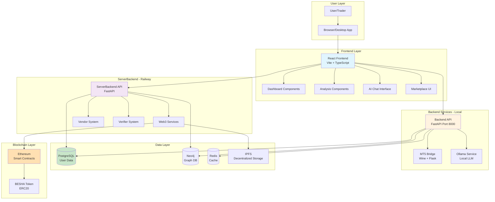
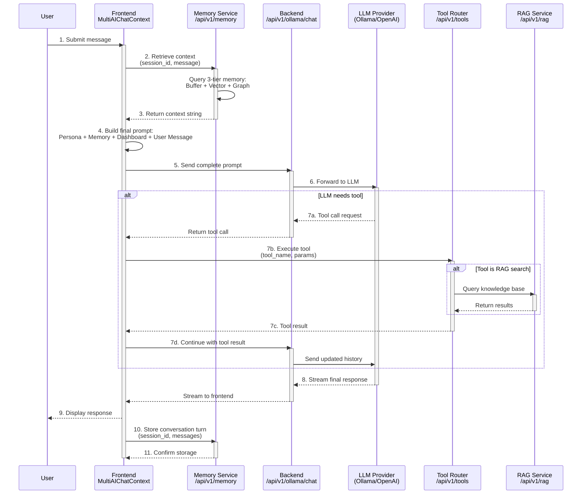

# FinDash Buddy - Your AI-Powered Trading Laboratory

 
> **This is the story of how I turned years of chaos into the trading partner I always wished existed.**

> [!CAUTION]
> **UNDER DEVELOPMENT: Still polishing, still fixing, still building!** 🚧

---

## 🚀 Beyond a Trading Tool: The FinDash Buddy Ecosystem

FinDash Buddy is a powerful, standalone AI-powered trading laboratory, it is also the gateway to a revolutionary financial ecosystem powered by the **BESHA** utility token. This project's vision extends far beyond charts and models to create a community-owned, decentralized economy.

**BESHA ("PESA" in Swahili)** is founded on three core principles:

1.  **Reputation-First Economy**: Your on-chain reputation matters more than your wallet size. Good actors are rewarded, while bad actors are publicly and permanently flagged.
2.  **Real Utility from Day One**: BESHA is a utility token with built-in demand—the required currency for AI model access, data contributions, peer-to-peer commerce, and earning rewards.
3.  **Community Ownership**: The ecosystem is designed to share 70% of platform revenues back to the token holders, contributors, and operators who create its value.

This ecosystem is comprised of two main applications:
*   **FinDash Buddy**: The AI trading laboratory detailed in this README.
*   **Dumo**: A social finance "Chat-app" for messenger/whatsapp  type messaging and peer-to-peer commerce, group savings, and more.

To learn more, read the full [**BESHA Introduction & Whitepaper**](./BESHA_INTRODUCTION.md).
---

## 👋 Hey! I'm Daniel — And This Is the Tool I Built for Myself (and Now for You)

I have spent over 10 years learning and researching for Machine learning and finance, I was that guy drowning in notebooks, CSVs, and half-baked models. One notebook for Gold, another for BTC, another for NAS100… same code, just copy-paste. I created and trained accurate models that I lost track of. Every model demanded its own environment and my laptop looked like a data crime scene.

I believe in **data for evidence** with repeatable experiments/measurements,  this drove the need to have anenvironment where I would create , train and deploy this models.  

**"And here we are!"**

So I stopped jumping between scattered pipelines and built one unified system — a real lab where my technical analysis, astro cycles, volatility studies, ML models, and RL agents could live together.

That lab became **FinDash Buddy**.


*My command center. Live charts, smart metrics, my watchlist — everything I used to jump between in 10 tabs now lives in one place.*

---

## 🎯 Why I'm Building FinDash Buddy

Trading is about being sure of your **next step** or making decisions based on an optimal path for your goal: making profits consistently. For me, building FinDash Buddy was about moving from guesswork to **evidence-based confidence**. I wanted a system where data actively backs up every reason for entering a trade.

Through years of backtesting, I've learned a critical lesson: most market situations are explainable with data. When you have that data, you can formulate hypotheses that either stand or fall. I wanted to understand the *reasoning* behind every signal—whether from a technical system or a deep learning model—making the decision process transparent and repeatable.

The reasons for building this are endless, but here are the ones that kept me up at night:

*   **Breaking the Cycle**: I was tired of training an LSTM on Gold, only to have to start from zero for EURUSD. I needed a factory that could scale experiments efficiently.
*   **Democratizing Power**: Make Findash available to all users?
*   **From Lab to Live**: I've seen brilliant open-source models (some of which I built) sit idle because there was no easy way to plug them into a real trading environment.
*   **Focus over Chaos**: I was switching between 15 different apps just to understand a single market move. I needed one "Command Center."

So I asked myself:
**"What if I gave every trader — coder or not — the same firepower I designed for myself?"**

That question became the soul of FinDash Buddy.

> [!NOTE]
> You really should read the full [**BESHA Introduction & Whitepaper**](./BESHA_INTRODUCTION.md) to understand the larger vision.

---
## 🎯 So What is Findash?

FinDash Buddy is your advanced **AI-Powered Trading Laboratory**, designed to bridge the gap between complex quantitative analysis and everyday trading. Findash app comes as an installable and is designed for offline first, meaning you can interact with your agents and models even without internet. However since Findash is built on web3 and depends on blockchain, online access is mandatory after a while to sync blockchain security, whilst ensuring you can still make transactions while offline. Findash is a unified ecosystem where you can create, explore and discover, analyze, and automate your trading strategies using state-of-the-art AI.

### 🏗️ System Architecture




### 📊 Intelligent Dashboard Metrics
The dashboard doesn't just show you numbers; it gives you **context**. Behind every symbol, Findash calculates real-time "Smart Metrics":


- **Price & Change**: Real-time tracking of market value and movement.
- **Volatility**: Measures the average price range as a percentage, helping you gauge risk instantly.
- **Speed**: The velocity of price movement—identifying when the market is "accelerating."


The Three Bar display when attached to a model should display forecast levels and daily expected moves, similar to the srength chart.  

- **Direction**: A clear "Bullish" or "Bearish" designation based on momentum and trend analysis. You can click on any card to ge more in-depth analysis. 


- **Regime**: Tells you if the market is currently **Stable** or **Volatile**, allowing you to adjust your strategy accordingly.


- **Multi-Timeframe Alignment**: See all the above across M1, M5, H1, H4, and D1 simultaneously to ensure your trade has "consensus" across the board.


All components in the dashboard can be attached to a ml model for predictive insight. Without models the dasboard uses default formulas to calculaet thhis metrics. The Chart view includes a Model predicions chart (right side) To forecast future prices. During research I found that simple lstms perfomed better in these time series forecast. 

The Dashboard metrics can then be used by your llm for context or train custom dqn agents that you can then either run solo or plug to the llm agent. The llm agent helps translate metrics into human understandable form. Within the framework the agent is forced or compelled to act within data boundaries. 

For Trade Execution the platform will have an internal playground; A Virtual trading Environment for backtesing and where you can train your agents and the MT5 Live trader where you can execute live trades to the market. 


### 🤖 The Agentic Framework: Hire Your AI Staff
I wanted to create an agent who would explain to me why they took a particula trade, or why the dqn agent behaves the way it does in a trading environment. This pushed me to learn and implement an all-round llm architecure that complements and comprehends the overall analysis arcitecture of the dashboard. You  can **hire agents** to do  everything trading for you.  But my policy remains the agentt shhould complement your strategy or help you improve. Do not rely 100% on the agent!. In Findash you can:
- **Easy Creation**: Use the **Create Agent** to "hire" an agent for any asset. 
- **Customize your Agent**: Give your agent ML models for context
- **Custom Instructions**: Give your agent a "Mission"—e.g., *"Notify me when RSI is oversold on 15m but the daily trend is bullish."*
- **Bounded Autonomy**: Your agents operate 24/7 within the parameters you set, monitoring live streams and executing their "Mission" instructions autonomously.
- **Deployment**: Once "hired," your agents live in the **Side Panel**, constantly scanning, thinking, and ready to alert you or take action.


### 🛠️ Agentic Toolbelt
Your agents aren't just reading text; they have access to powerful tools to make better decisions:
- **🌐 Web Search**: Agents can search the live internet for breaking news and real-time market sentiment.
- **📚 RAG Knowledge Base**: Access to a massive financial database for deep historical context.
- **🔍 SQL Querying**: Secure, direct access to the trading database to verify patterns.
- **🧠 Model Inference**: The ability to run your own **Trained ML Models** to predict future price action.

### 🏭 The "Money Factory" Training Pipeline
Findash includes a professional-grade **Analysis Pipeline** that takes you from raw data to a deployed AI agent:
1. **Data Source**: Load MT5 or CSV data.
2. **Technical & SNR**: Auto-calculate 50+ indicators and Support/Resistance zones.
3. **Cosmic & Sentiment**: Add Astronomical cycles and News sentiment into the mix.
4. **Feature Review**: Use advanced statistics to keep only the features that actually work.
5. **ML Preparation**: Build "ML-ready" sequences for neural networks.
6. **Model Selection**: Choose from **LSTM, TCN, Transformers**, or **CNN** architectures.
7. **Model Training** : Now train your model  with the training / test data we just created in the ml step
8. **Deployment**: Once trained, your model can be "plugged in" to your AI Agents for live execution.

### ✨ Why Findash Wins (Our Strengths)
- **Unified Lab**: No more jumping between 10 apps. Charts, Indicators, ML Training, and AI Agents all live in one house.
- **No-Code AI**: You can build and train some of the world's most advanced Deep Learning models without writing a single line of code.
- **Evidence-Based Trading**: Stop guessing. Every decision is backed by the 9-step factory and measurable data.
- **Proactive Intelligence**: Your agents don't wait for you to open the app; they are working for you while you sleep.


### 🧠 AI & LLM Architecture: Local-First Intelligence

Findash is built on a **Local-First** AI philosophy. While we support major cloud providers (OpenAI, Anthropic, Gemini), the heart of the platform is the **Ollama Integration**.


- **Privacy & Speed**: By running models locally (like Llama 3.1 or Phi-3), your trading data never leaves your machine, and inference happen with zero network latency.
- **Provider Pattern**: The `AIManager` backend uses a modular provider pattern, allowing you to hot-swap between local Ollama instances and cloud APIs without changing your agent's instructions.

It is with this architecure that I will introduce my own llm that I had been working on a while, but for stability I have designed the system around the Ollama architecture. Transformers js proved to be more memory intensive and so I shifted from it.

### 🔄 AI Request Lifecycle

The following diagram shows how your AI requests flow through the system, from your message to the final response:



This architecture ensures that every AI response is:
- **Contextual**: Backed by 3-tier memory (recent messages, semantic search, knowledge graph)
- **Informed**: Can access real-time market data, analysis tools, and RAG knowledge
- **Persistent**: All conversations are stored for future reference and learning


### 🛠️ Setting Up Your AI Council


Findash allows you to create a personalized "Board of Directors" for your trading. Here is how you configure your agents:

1.  **Open the Council**: Click the AI Chat button to open the `MultiAIChatWindow`.
2.  **Add Participant**: Click the "+" button to open the `AIParticipantSelector`.
3.  **Choose a Template or Go Custom**:
    *   **Templates**: Select pre-tuned experts like "Bull Analyst" (optimistic pattern seeker), "Risk Manager" (conservative), or "Technical Purist".
    *   **Custom**: Define your own agent. Give it a name, an avatar, and a specific "System Prompt" (Mission).
4.  **Select the Brain**: Choose the underlying model. You can assign a lightweight local model (e.g., `Phi-3`) for quick queries and a heavy cloud model (e.g., `GPT-4-Turbo`) for complex reasoning.


### 🔄 The Life of a Request: From Prompt to Profit

How does the magic happen? Let's trace a request like:
*"Run a correlation analysis for EURUSD and Gold, then send me a report."*

1.  **Context Assembly (The "Input")**:
    *   The **Frontend** grabs the current state: Price of EURUSD, Gold, current indicators (RSI=70, MACD=Bullish), and recent news headlines.
    *   It packages this into a "Context Block" invisible to you but vital for the AI.

2.  **Orchestration (The "Decision")**:
    *   The `MultiAIChatContext` analyzes your request. It sees you need data comparison.
    *   If you addressed a specific agent (e.g., `@Quant`), it routes strictly to them. If not, the "Orchestrator" decides who is best suited (e.g., the Data Analyst agent).

3.  **Tool Execution (The "Action")**:
    *   The agent realizes it needs historical correlation data. It triggers the `execute_analysis` tool.
    *   **Backend**: The `tool_router` receives this, runs a Python script to calculate the Pearson Correlation Coefficient over the last 90 days, and returns the result (e.g., `0.85 positive correlation`).

4.  **Synthesis & Response**:
    *   The agent receives this number. It doesn't just print it; it *interprets* it:
    *   *"EURUSD and Gold are maintaining a strong 0.85 correlation. Given Gold's recent breakout, EURUSD is statistically likely to follow upwards."*

5.  **Future Actions (The "Enhancement")**:
    *   *Coming Soon*: The agent triggers the `email_service` tool to format this insight into a PDF and email it to you automatically.

### 💬 Example Prompts & Agent Responses

Here is how different agents interpret the same market data:

**Scenario**: EURUSD is approaching a major resistance level at 1.1000.

#### 1. The "Bull Analyst" (`@Bull`)
> **User**: "What's the play here?"
> **Response**: "I'm seeing a classic **Cup and Handle** forming on the H4 timeframe! Volume is rising on the approach to 1.1000. If we break this resistance, we have wide open skies until 1.1050. I recommend looking for buy stops above the breakout!"

#### 2. The "Risk Manager" (`@Risk`)
> **User**: "What's the play here?"
> **Response**: "Caution is advised. We are at a historic rejection point (1.1000). RSI is also overbought at 75. Even if you are bullish, waiting for a confirmed retest of 1.1000 turns resistance into support. Don't chase the green candles; wait for the setup."

#### 3. The "Sentiment Scout" (`@Sentiment`)
> **User**: "What is the market feeling?"
> **Response**: "I've scanned recent news and Twitter sentiment. There is a lot of chatter about the upcoming ECB announcement. The 'Fear & Greed Index' is at 65 (Greed), suggesting the crowd is getting euphoric. Be careful of a 'buy the rumor, sell the news' event."

### 🚀 Advanced Capabilities: The Autonomous Hedge Fund (Beta)

The system has evolved from a simple chatbot to a semi-autonomous trading backend.


#### 1. Autonomous Agent Loops (`AgentRunner`)
Your agents don't just chat; they work.
*   **Bounded Autonomy**: You can assign an agent to "Watch" a specific asset (e.g., BTCUSD).


*   **The Loop**: Every hour (or your set interval), the agent:
    1.  Wakes up.
    2.  Reads the latest 10 candles and technical indicators.
    3.  Consults its "Mission" (e.g., "Find RSI divergence").
    4.  **Decides**: Outputs a structured decision: `WAIT`, `BUY`, `SELL`, or `NOTIFY`.
    5.  **Acts**: Updates your dashboard or sends an alert.


  


#### 2. The "Cosmic" Data Layer
Findash now correlates financial data with non-traditional datasets to find hidden edges:
*   **☀️ Space Weather**: Ingests Solar Wind and Kp Index data from NOAA. (Research suggests geomagnetic storms correlate with market volatility).
*   **🌍 Seismic Activity**: Tracks global earthquakes via USGS to predict regional economic disruptions. Ask your agent  "Are there any meaningful correlations between Earthquakes and Stock A?" Your agent will use te tools in the Python backend to fetch data for the Asset ,  Merge with Earthquake data and run analysis or interprete themeselves.  You can also independently run such analysis using the Analysis pipeline. 
*   **🐍 Python Sandbox**: A secure environment to write and test your *own* Python indicators against live market data without crashing the server.


### 🔮 Future Enhancements
*   **Collaborative Swarms**: Multiple agents debating a trade live in your chat window—The Technical Analyst arguing with the Fundamental Analyst—giving you a balanced perspective before you click 'Buy'.
*   **Direct Broker Execution**: Allowing agents to not just signal 'BUY', but execute it via bridge API (User approval required). 

### 🌉 The MT5 Bridge: Decentralized Data Gateway
To ensure Findash is accessible and robust, I built a custom 


**MT5-Bridge**. This is a high-performance Wine-based wrapper that exposes the MetaTrader 5 terminal as a clean, modern Flask API.
- **Why MetaTrader 5?**: 
    - **Total Accessibility**: MT5 is free and available to any trader with a brokerage account worldwide.
    - **Decentralization by Design**: Since MT5 supports thousands of brokers, Findash is not tied to a single liquidity provider. If one broker goes down, you simply switch your bridge to another—one failure won't affect the entire platform.
    - **Reliability**: We wrap the native MQL5 environment in a Pythonic API, allowing for stable, "hands-off" data streaming and trade execution.

### 💻 Python & JavaScript to MQL5: Bridging the Gap
One of the biggest hurdles in trading is the "MQL5 tax"—the requirement to learn a specific, C++ like language just to test a simple idea. Findash solves this by bridging the worlds of Web and Data Science:


- **Unified Logic**: Through the **Code Window**, you can write your trading logic in **Python or JavaScript**. 
- **The MQL5 "Bypass"**: You get the power of MQL5's market access without ever having to touch a `.mq5` file. Your Python/JS code interacts with the bridge to execute trades, calculate custom indicators, and run ML inferences with ease.
- **Rapid Prototyping**: Go from a data science experiment in a notebook to a live-running strategy in minutes.


## 🔬 The 9-Step Analysis Pipeline: From Raw Data to Predictions

This is where the magic happens. FinDash Buddy's analysis pipeline is a **modular, step-by-step factory** for turning raw market data into actionable predictions. Each step builds on the previous one, creating a comprehensive dataset ready for machine learning.

### Pipeline Overview

```mermaid
graph LR
    START([Start Analysis]) --> STEP1
    
    subgraph "Step 1: Data Source"
        STEP1[Select Data Source<br/>MT5 or CSV]
        STEP1 --> MT5DATA[MT5 Connection]
        STEP1 --> CSVDATA[CSV Upload]
        MT5DATA --> OHLCV1[OHLCV Data]
        CSVDATA --> OHLCV1
    end
    
    OHLCV1 --> STEP2
    
    subgraph "Step 2: Technical Analysis"
        STEP2[Calculate Indicators<br/>50+ Indicators]
        STEP2 --> IND[RSI, MACD, BB,<br/>SMA, EMA, etc.]
    end
    
    IND --> STEP3
    
    subgraph "Step 3: SNR Analysis"
        STEP3[Support & Resistance<br/>K-Means Clustering]
        STEP3 --> SNR[SNR Zones<br/>Breakout Signals]
    end
    
    SNR --> STEP4
    
    subgraph "Step 4: Astronomical"
        STEP4[Cosmic Features<br/>Optional]
        STEP4 --> ASTRO[Lunar Phases<br/>Planetary Positions]
    end
    
    ASTRO --> STEP5
    
    subgraph "Step 5: News Sentiment"
        STEP5[Sentiment Analysis<br/>News & Social]
        STEP5 --> SENT[Fear/Greed Index<br/>Event Impact]
    end
    
    SENT --> STEP6
    
    subgraph "Step 6: Feature Review"
        STEP6[Statistical Analysis<br/>Quality Control]
        STEP6 --> STATS[VIF, Correlation<br/>Outliers, PCA]
    end
    
    STATS --> STEP7
    
    subgraph "Step 7: ML Preparation"
        STEP7[Dataset Builder<br/>Sequences & Scaling]
        STEP7 --> MLDATA[Train/Val/Test<br/>Scaled Sequences]
    end
    
    MLDATA --> STEP8
    
    subgraph "Step 8: Model Training"
        STEP8[Select Architecture<br/>LSTM/TCN/Transformer]
        STEP8 --> MODEL[Trained Model<br/>Weights Saved]
    end
    
    MODEL --> STEP9
    
    subgraph "Step 9: Results"
        STEP9[Performance Metrics<br/>Predictions]
        STEP9 --> RESULTS[Sharpe Ratio<br/>Win Rate<br/>Predictions]
    end
    
    RESULTS --> END([Deploy Model])
    
    style STEP1 fill:#e3f2fd
    style STEP2 fill:#f3e5f5
    style STEP3 fill:#e8f5e9
    style STEP4 fill:#fff3e0
    style STEP5 fill:#fce4ec
    style STEP6 fill:#e0f2f1
    style STEP7 fill:#f1f8e9
    style STEP8 fill:#ede7f6
    style STEP9 fill:#e8eaf6
```



---

### **Step 1: Data Source - The Foundation**

**What it does:** Connects to your data sources and loads market data  
**Inputs:** MT5 connection, CSV files, or mixed datasets  
**Outputs:** Clean OHLCV (Open, High, Low, Close, Volume) time series data


**Why this matters:** Garbage in = garbage out. This step ensures your data is clean, properly formatted, and ready for analysis.

**What you can do:**
- Connect to MetaTrader 5 (MT5) for live/historical data
- Upload CSV files with custom market data
- Merge multiple data sources (e.g., combine MT5 with external sentiment data)
- Select symbols, timeframes (M1, M5, H1, H4, D1, etc.)
- Set date ranges for historical analysis


**Expected output:** A validated dataset with timestamps, OHLCV data, and metadata


---

### **Step 2: Technical Analysis - The Math Layer**

**What it does:** Calculates 50+ technical indicators and their differentials  
**Inputs:** Raw OHLCV data from Step 1  
**Outputs:** Enriched dataset with indicators (SMA, EMA, RSI, MACD, Bollinger Bands, etc.)


**Available Indicators:**
- **Trend:** SMA (multiple periods), EMA, DEMA, TEMA, WMA
- **Momentum:** RSI, Stochastic, CCI, Williams %R, ROC
- **Volatility:** Bollinger Bands, ATR, Standard Deviation, Keltner Channels
- **Volume:** OBV, VWAP, Volume MA, Money Flow Index
- **Oscillators:** MACD, Stochastic RSI, Ultimate Oscillator
- **Custom:** Parabolic SAR, Ichimoku, Supertrend, Pivot Points


**Chart Visualizations:**
1. **Main Price Chart** - Candlestick/Line/Area/Bar/Heikin-Ashi
2. **RSI Panel** - Separate panel showing RSI oscillator with overbought/oversold zones
3. **MACD Panel** - MACD line, signal line, and histogram


**What you can configure:**
- Select which indicators to calculate
- Customize periods (e.g., SMA 20, 50, 200)
- Set MACD parameters (fast: 12, slow: 26, signal: 9)
- Configure Bollinger Bands (length: 20, std: 2)
- Enable/disable indicator differentials (rate of change)

**Expected output:** Dataset with 50-150 new columns depending on configuration

---

### **Step 3: Support & Resistance (SNR) - The Zones**

**What it does:** Automatically detects support and resistance zones using clustering algorithms  
**Inputs:** OHLCV + Technical indicators  
**Outputs:** SNR zones, breakout signals, bounce signals


**How it works:**
1. **Zone Detection:** Uses K-Means clustering to find price levels where price repeatedly bounces
2. **Strength Calculation:** Measures how many times price respected each zone
3. **Signal Generation:** Identifies breakouts, bounces, and rejections

**Configuration Options:**
- **Lookback Period:** How far back to search for zones (default: 500 candles)
- **Confirmation Period:** Candles needed to confirm a zone (default: 3)
- **Lookforward Period:** Future candles to validate signals (default: 10)
- **Number of Clusters:** How many SNR zones to identify (default: 8)
- **Zone Width:** Thickness of each zone in percentage (default: 0.5%)
- **Minimum Distance:** Minimum separation between zones (default: 1%)


**Signals Generated:**
- `SNR_Signal`: -1 (resistance rejection), 0 (neutral), +1 (support bounce)
- `SNR_Strength`: Confidence score (0-1)
- `SNR_Zone_Type`: Support or Resistance
- `SNR_Distance`: Distance to nearest zone

**Chart Display:**
- Horizontal zones overlaid on price chart
- Color-coded by strength (green = strong support, red = strong resistance)
- Signal markers at breakout/bounce points

---

### **Step 4: Astronomical Features - The Cosmic Edge**

**What it does:** Calculates planetary positions, lunar phases, and astronomical aspects  
**Inputs:** Time series data with timestamps  
**Outputs:** Astronomical features correlated with market cycles

**Why astronomy?** Not superstition — statistical correlation. Markets are driven by human psychology, and human behavior shows measurable patterns with lunar cycles, planetary aspects, and seasonal timing.  You can entirely skip this step. 


**Features Calculated:**
- **Lunar Phase:** New Moon, Waxing Crescent, First Quarter, Waxing Gibbous, Full Moon, Waning Gibbous, Last Quarter, Waning Crescent
- **Planetary Positions:** Sun, Moon, Mercury, Venus, Mars, Jupiter, Saturn positions in zodiac
- **Major Aspects:** Conjunction (0°), Opposition (180°), Trine (120°), Square (90°), Sextile (60°)
- **Retrograde Periods:** Mercury, Venus, Mars retrograde indicators
- **Seasonal Timing:** Equinoxes, solstices, quarter markers


**Configuration:**
- Select which celestial bodies to track
- Choose aspect types (major vs minor)
- Set orb tolerance for aspects (±5°)
- Enable/disable retrograde tracking


**Visualization:**
- **Orbital Chart:** Shows planetary positions over time
- **Aspect Timeline:** Marks when major aspects occur
- **Phase Correlation:** Overlays lunar phases on price chart

**Expected Output:** 20-40 astronomical columns added to dataset

---

### **Step 5: News Sentiment - The Mood Detector**

**What it does:** Analyzes news headlines and social media sentiment  
**Inputs:** Time-aligned news data, social media feeds  
**Outputs:** Sentiment scores, fear/greed index, event markers


Images/Screenshot from 2026-01-11 11-59-00.png

**Data Sources:**
- Financial news APIs (Bloomberg, Reuters, etc.)
- Social media (Twitter/X, Reddit, StockTwits)
- Economic calendars (Fed announcements, earnings, etc.)

**Sentiment Metrics:**
- **Overall Sentiment:** -1 (bearish) to +1 (bullish)
- **Fear/Greed Index:** 0 (extreme fear) to 100 (extreme greed)
- **Event Impact Score:** Predicted market impact (0-10)
- **Keyword Frequency:** Mentions of key terms (recession, rally, crash, etc.)

**Expected Output:** Sentiment columns aligned with price data timestamps

---

### **Step 6: Feature Review - The Quality Control**

**What it does:** Statistical analysis and quality checks on all features  
**Inputs:** Complete dataset with all features from Steps 1-5  
**Outputs:** Feature importance scores, correlation matrices, quality reports


**Analysis Modules:**

#### 6.1 **Descriptive Statistics**
- Mean, median, standard deviation
- Min, max, quartiles (Q1, Q3)
- Skewness, kurtosis
- Missing value percentage
- Coefficient of variation

**Chart:** Histogram distribution for each feature

#### 6.2 **Feature Importance**
- Random Forest feature importance scores
- F-statistic and p-values (ANOVA)
- Identifies which features have predictive power

**Chart:** Bar chart ranking features by importance


#### 6.3 **Correlation Analysis**
- Pearson correlation matrix
- Identifies highly correlated features (multicollinearity)
- Highlights significant correlations with target

**Chart:** Heatmap showing feature correlations

#### 6.4 **Multicollinearity Detection**
- VIF (Variance Inflation Factor) scores
- Condition number analysis
- Recommends features to remove

**Chart:** VIF scores bar chart

#### 6.5 **Outlier Detection**
- IQR method (Interquartile Range)
- Z-score method
- Isolation Forest algorithm
- Reports outlier percentage per feature

**Chart:** Box plots showing outliers


#### 6.6 **Time Series Tests**
- **ADF Test:** Tests for stationarity
- **KPSS Test:** Confirms stationarity
- Identifies if differencing is needed

**Chart:** Time series plot with stationarity indicators

#### 6.7 **Distribution Analysis**
- Normality tests (Shapiro-Wilk)
- Skewness interpretation
- Kurtosis interpretation
- Identifies multimodal distributions

**Chart:** Q-Q plots, distribution curves

#### 6.8 **PCA (Principal Component Analysis)**
- Dimensionality reduction
- Variance explained by components
- Scree plot showing optimal component count
- Component loadings (which features contribute to each PC)

**Charts:**
- Scree plot (variance explained)
- Component correlation heatmap
- Cumulative variance curve

**What you can do:**
- Select which analysis modules to run
- Choose columns to analyze
- Set thresholds for outlier detection
- Review and remove problematic features
- Export quality reports

**Expected Output:** Clean, validated dataset ready for ML + detailed quality report

---

### **Step 7: ML Preparation - The Dataset Builder**

**What it does:** Transforms tabular data into ML-ready sequences  
**Inputs:** Clean feature dataset from Step 6  
**Outputs:** Train/validation/test splits, scaled sequences, target labels


**Configuration Options:**


#### **Sequence Parameters:**
- **Sequence Length:** How many past candles to use as input (default: 60)
  - Example: 60 means "use last 60 candles to predict next N candles"
- **Prediction Length:** How many future candles to predict (default: 4)
  - Example: 4 means "predict next 4 candles' close prices"


#### **Target Columns:**
- Select what to predict:
  - `close` (price prediction)
  - `direction` (up/down classification)
  - `volatility` (volatility regime)
  - `snr_signal` (support/resistance signals)
  - Custom targets


#### **Feature Selection:**
- **Exclude Columns:** Remove non-predictive columns (timestamps, symbols, etc.)
- **Include All:** Use all available features
- **Custom Selection:** Manually pick features

#### **Scaling:**
- **MinMax Scaler:** Scales to [0, 1] range (best for neural networks)
- **Standard Scaler:** Z-score normalization (mean=0, std=1)
- **Robust Scaler:** Uses median and IQR (resistant to outliers)
- **Save Scaler:** Save scaler parameters for production use
- **Load Scaler:** Use pre-trained scaler for consistency

#### **Data Splitting:**
- **Train Ratio:** Percentage for training (default: 70%)
- **Validation Ratio:** Percentage for validation (default: 15%)
- **Test Ratio:** Percentage for testing (default: 15%)
- **Split Strategy:**
  - **Sequential:** Time-ordered split (recommended for time series)
  - **Random:** Shuffled split (not recommended for time series)
  - **Stratified:** Balanced class distribution (for classification)

#### **Advanced Options:**
- **Random Seed:** For reproducibility (default: 42)
- **Shuffle Data:** Whether to shuffle sequences (usually False for time series)
- **Handle Class Imbalance:** Apply SMOTE or class weights

**Output Metrics:**
- **Total Sequences:** Number of sequences created
- **Train Sequences:** Count in training set
- **Validation Sequences:** Count in validation set
- **Test Sequences:** Count in test set
- **Input Shape:** `[sequence_length, num_features]` (e.g., `[60, 45]`)
- **Output Shape:** `[prediction_length, num_targets]` (e.g., `[4, 1]`)
- **Signal Distribution:** Class balance for classification targets
- **Scaled Features:** Number of features after scaling

**Charts:**
- **Sequence Distribution:** Bar chart showing train/val/test split
- **Signal Distribution:** Pie chart showing class balance
- **Feature Scaling:** Before/after scaling comparison

**Expected Output:** 
```python
{
  "X_train": np.array([...]),  # Shape: (num_train_sequences, sequence_length, num_features)
  "y_train": np.array([...]),  # Shape: (num_train_sequences, prediction_length, num_targets)
  "X_val": np.array([...]),
  "y_val": np.array([...]),
  "X_test": np.array([...]),
  "y_test": np.array([...]),
  "scaler": MinMaxScaler(...),
  "config": {...}
}
```

---

### **Step 8: Model Selection & Training - The Brain**


**What it does:** Build, configure, and train deep learning models  
**Inputs:** ML-ready sequences from Step 7  
**Outputs:** Trained model with performance metrics


**Model Architectures Available:**

#### **1. LSTM (Long Short-Term Memory)** 🔄
- **Best for:** Sequential patterns, trend following
- **Complexity:** Medium
- **Parameters:**
  - `lstm_units`: [64, 128, 256] - Number of LSTM cells per layer
  - `num_layers`: [1, 2, 3, 4] - Depth of network
  - `dropout`: [0.0 - 0.5] - Regularization to prevent overfitting
  - `bidirectional`: [True/False] - Process sequences forward and backward
  - `return_sequences`: [True/False] - For stacked LSTMs

**Example Architecture:**
```
Input (60, 45) → LSTM(128) → Dropout(0.2) → LSTM(64) → Dense(4)
```

#### **2. TCN (Temporal Convolutional Network)** ⏱️
- **Best for:** Fast training, long-range dependencies
- **Complexity:** Medium-High
- **Parameters:**
  - `num_filters`: [32, 64, 128] - Convolutional filters per layer
  - `kernel_size`: [2, 3, 5, 7] - Size of convolutional kernel
  - `num_layers`: [4, 6, 8] - Number of residual blocks
  - `dilation_rates`: [[1,2,4,8], [1,2,4,8,16]] - Exponential dilation
  - `dropout`: [0.0 - 0.3]


**Example Architecture:**
```
Input (60, 45) → TCN Block(64, dilation=1) → TCN Block(64, dilation=2) → 
TCN Block(64, dilation=4) → TCN Block(64, dilation=8) → Dense(4)
```

#### **3. Transformer** 🤖
- **Best for:** Complex patterns, attention mechanisms
- **Complexity:** High
- **Parameters:**
  - `d_model`: [64, 128, 256] - Model dimension
  - `num_heads`: [4, 8, 16] - Multi-head attention heads
  - `num_layers`: [2, 4, 6] - Transformer blocks
  - `d_ff`: [256, 512, 1024] - Feed-forward dimension
  - `dropout`: [0.0 - 0.3]
  - `use_positional_encoding`: [True/False]

**Example Architecture:**
```
Input (60, 45) → Positional Encoding → 
Transformer Block (d_model=128, heads=8) × 4 → Dense(4)
```

#### **4. CNN (Convolutional Neural Network)** 🔍
- **Best for:** Pattern recognition, feature extraction
- **Complexity:** Low-Medium
- **Parameters:**
  - `filters`: [[32, 64, 128]] - Filters per conv layer
  - `kernel_sizes`: [[3, 5, 7]] - Kernel sizes
  - `pool_sizes`: [[2, 2, 2]] - Max pooling sizes
  - `dense_units`: [128, 256] - Fully connected layer size


Images/Screenshot from 2026-01-11 12-02-12.png
#### **5. Hybrid Models** 🔗
- **CNN-LSTM:** CNN for feature extraction + LSTM for sequences
- **CNN-TCN:** CNN + TCN for multi-scale patterns
- **Transformer-LSTM:** Attention + recurrence

#### **6. 3D-CNN** 📦
- **Best for:** Multi-timeframe analysis
- **Complexity:** High
- **Use case:** Analyzing multiple timeframes simultaneously

#### **7. DNN (Deep Neural Network)** 🧠
- **Best for:** Simple tabular data, baseline models
- **Complexity:** Low
- **Parameters:**
  - `layers`: [[256, 128, 64]] - Layer sizes
  - `activation`: ['relu', 'tanh', 'elu']
  - `dropout`: [0.0 - 0.5]

**Training Configuration:**

- **Optimizer:** Adam, SGD, RMSprop, AdamW
- **Learning Rate:** 0.0001 - 0.01 (with scheduler options)
- **Batch Size:** 16, 32, 64, 128
- **Epochs:** 50, 100, 200, 500
- **Loss Function:**
  - Regression: MSE, MAE, Huber
  - Classification: Binary Crossentropy, Categorical Crossentropy
- **Early Stopping:** Stop if validation loss doesn't improve for N epochs
- **Model Checkpointing:** Save best model during training

**What you can do:**
1. **Browse Model Catalog:** View all available architectures
2. **Filter by Category:** LSTM, CNN, TCN, Transformer, Hybrid
3. **Filter by Complexity:** Low, Medium, High
4. **Search Models:** Find specific architectures
5. **Select Model:** Choose architecture that fits your use case
6. **Configure Parameters:** Adjust hyperparameters using sliders/inputs
7. **Build Model:** Generate model summary and architecture diagram
8. **Train Model:** Start training with real-time progress
9. **Monitor Training:** View loss curves, accuracy metrics
10. **Save Model:** Save trained model to library or marketplace

**Expected Output:**
- **Model Summary:** Layer-by-layer architecture description
- **Training Metrics:**
  - Training Loss/Accuracy per epoch
  - Validation Loss/Accuracy per epoch
  - Test Accuracy (final evaluation)
- **Performance Metrics:**
  - Sharpe Ratio (risk-adjusted returns)
  - Win Rate (percentage of profitable predictions)
  - Profit Factor (gross profit / gross loss)
  - Max Drawdown
- **Model File:** Saved weights (.h5 or .pth format)
- **Configuration File:** JSON with all hyperparameters

---

### **Step 9: Results - The Proof**

**What it does:** Displays model predictions and performance analysis  
**Inputs:** Trained model + test data  
**Outputs:** Predictions, confidence scores, performance charts


**Results Display:**

#### **Prediction Output:**
- **Direction:** Bullish/Bearish/Neutral
- **Confidence:** 0-100% confidence score
- **Predicted Prices:** Next N candle close prices
- **Volatility Regime:** Low/Medium/High/Extreme
- **Probability Distribution:** Confidence intervals

#### **Performance Metrics:**
- **Training Accuracy:** How well model learned training data
- **Validation Accuracy:** Performance on unseen validation data
- **Test Accuracy:** Final performance on test set
- **Sharpe Ratio:** Risk-adjusted returns (higher is better)
- **Win Rate:** Percentage of correct predictions
- **Profit Factor:** Total profit / total loss ratio
- **Max Drawdown:** Largest peak-to-trough decline

#### **Visualization Charts:**
1. **Prediction vs Actual:** Line chart comparing predictions to reality
2. **Confusion Matrix:** For classification tasks
3. **Equity Curve:** Cumulative returns over time
4. **Loss Curves:** Training and validation loss over epochs
5. **Feature Importance:** Which features the model relied on most

**What you can do:**
- **Review Results:** Analyze model performance
- **Export Predictions:** Save predictions to CSV
- **Save Model:** Add to your model library
- **Publish to Marketplace:** Share/sell your model
- **Generate Report:** Create PDF summary
- **Backtest Strategy:** Test trading strategy with predictions
- **Deploy Model:** Use for live trading signals

---

## 📊 Chart Types & Visualizations

FinDashBuddy supports **5 chart types** with extensive customization:

### **1. Candlestick Charts** 🕯️
- **Use case:** Standard price action analysis
- **Features:**
  - Green candles (bullish): Close > Open
  - Red candles (bearish): Close < Open
  - Wicks show high/low range
  - Customizable colors and styles

### **2. Line Charts** 📈
- **Use case:** Clean trend visualization
- **Features:**
  - Connects close prices
  - Smooth trend lines
  - Multiple line overlays (SMA, EMA, etc.)

### **3. Area Charts** 🏔️
- **Use case:** Filled trend visualization
- **Features:**
  - Shaded area under line
  - Gradient fills
  - Emphasizes magnitude of movement

### **4. Bar Charts** 📊
- **Use case:** OHLC visualization
- **Features:**
  - Vertical bar shows high-low range
  - Horizontal ticks show open/close
  - Alternative to candlesticks

### **5. Heikin-Ashi Charts** 🎴
- **Use case:** Smoothed trend identification
- **Features:**
  - Modified candlestick calculation
  - Filters out noise
  - Clearer trend signals
  - Reduces false signals

**Chart Customization:**
- **Timeframes:** M1, M5, M15, M30, H1, H4, D1, W1, MN1
- **Indicators:** Overlay 50+ technical indicators
- **Drawing Tools:** Trend lines, horizontal lines, Fibonacci retracements
- **Templates:** Save/load chart configurations
- **Themes:** Dark mode, light mode, custom color schemes
- **Export:** Save charts as PNG/PDF

---


## 🌍 The Economy (Web3 Layer)

### **1. Automatic Wallet Creation** 🪄
**"No more MetaMask headaches for new users."**

When you sign up, FinDash Buddy automatically creates a secure Ethereum wallet for you.

**How it works:**
1. **Instant Creation:** As soon as you register, a unique wallet address is generated.
2. **Invisible Security:** Your private key is encrypted with your password and stored securely. We never see your raw key.
3. **Identity on Chain:** A digital identity is created for you on the blockchain (UnifiedIdentity contract).
4. **Welcome Gift:** You automatically receive an airdrop of BESHA tokens to get started.

**What you can do with it:**
- **Earn Rewards:** Get paid for contributing data or models.
- **Pay for Services:** Rent premium models or buy datasets.
- **Vote:** Participate in DAO governance.
- **Staking:** Stake tokens to earn interest.

### **2. Device Binding & Security** 🛡️
**"Your account, locked to your devices."**

We use **Device Binding** to ensure only *you* can access your account.

**How it works:**
1. **Fingerprinting:** When you log in, we take a "fingerprint" of your device (browser, OS, screen size, etc.).
2. **Binding:** This fingerprint is linked to your account.
3. **Verification:** If someone tries to log in from a new, unknown device, we block them or ask for extra verification.

**Why this matters:**
- **Anti-Theft:** Even if a hacker steals your password, they can't log in from their computer.
- **Alerts:** You get notified immediately if a new device tries to access your account.
- **Control:** You can manage your trusted devices in Settings.

### **3. Setup Wizard** 🚀
**"Get started in seconds."**

The new **Setup Wizard** guides you through:
1. **Account Creation:** Username, email, and password.
2. **Wallet Setup:** Automatic generation (you just watch!).
3. **Profile:** Add your name and phone (optional).
4. **Preferences:** Choose your theme (Dark/Light) and notification settings.
5. **Exchange Keys:** Connect Binance or Coinbase (encrypted & optional).

**Summary:**
- **We handle the tech:** You don't need to know about keys, gas, or contracts.
- **You own the value:** Your tokens and reputation are yours forever.
- **Safety first:** Bank-grade security with device checks and encryption.

### 🏦 Wallet & Treasury
- Manage BESHA tokens (platform currency)
- Track earnings from model rentals
- View revenue splits
- Withdraw to external wallet

---

## 💳 Subscription & Billing

FinDash Buddy operates on a **freemium model** with a powerful free tier and an enhanced Pro subscription.

### Free Tier (Forever Free)
- ✅ Basic dashboard metrics
- ✅ Manual analysis tools (all 9 steps)
- ✅ Community support
- ✅ Limited AI queries (10/day)
- ✅ 1 AI agent
- ✅ Basic model training
- ✅ Public marketplace access

### Pro Tier ($10/month in BESHA)
- ✅ **Everything in Free, plus:**
- ✅ Unlimited AI agent conversations
- ✅ Advanced model training (all architectures)
- ✅ Real-time alerts and notifications
- ✅ Priority support
- ✅ API access
- ✅ Custom indicators
- ✅ Up to 5 AI agents
- ✅ Portfolio management tools
- ✅ Advanced risk analytics
- ✅ Marketplace selling privileges

**Payment**: Subscriptions are paid in BESHA tokens. At $1/BESHA, the monthly cost is 10 BESHA. Payment is automatic via smart contract.

**Cancel Anytime**: No lock-in periods. Cancel your subscription at any time and keep access until the end of your billing period.

---

## 🎁 Early Adopter Rewards

### Airdrop Program

We reward our early supporters with BESHA token airdrops:

| User Type | BESHA Reward | Eligibility |
|-----------|--------------|-------------|
| **First 1,000 Users** | 100 BESHA | Register before March 2026 |
| **Beta Testers** | 250 BESHA | Active testing + bug reports |
| **Community Leaders** | 500 BESHA | Top contributors, educators |
| **Referral Bonus** | 50 BESHA | Per successful referral (max 10) |

**Vesting**: Airdrop tokens are immediately available with no lock-up period. Use them for subscriptions, marketplace purchases, or hold for appreciation.

### Mining Through Development

Earn BESHA by improving the platform—we call it "mining" because you're extracting value by solving problems:

#### Bug Fixes & Testing
| Severity | BESHA Reward | Description |
|----------|--------------|-------------|
| **Critical** | 500 BESHA | Security vulnerabilities, data loss bugs |
| **High** | 250 BESHA | Major functionality broken |
| **Medium** | 100 BESHA | Feature bugs, UI issues |
| **Low** | 50 BESHA | Minor issues, typos |
| **Test Cases** | 25-100 BESHA | Comprehensive test coverage |

#### Feature Development
| Contribution Type | BESHA Reward | Description |
|-------------------|--------------|-------------|
| **Major Feature** | 2,000-5,000 BESHA | New analysis module, AI capability |
| **Minor Feature** | 500-2,000 BESHA | UI improvements, integrations |
| **Documentation** | 50-200 BESHA | Guides, tutorials, API docs |
| **Code Review** | 25-100 BESHA | Quality reviews, refactoring |

#### Data Contribution
| Data Type | BESHA Reward | Description |
|-----------|--------------|-------------|
| **OHLCV Dataset** | 150-200 BESHA | 1 year, 15+ assets, validated |
| **News Articles** | 20-100 BESHA | With sentiment analysis |
| **Trading Signals** | 100-500 BESHA | With performance proof |
| **Quality Bonus** | +50% | Exceptionally accurate/useful data |

**How to Start Mining**:
1. Join our [GitHub repository](https://github.com/yourusername/fin-dash-buddy)
2. Browse open issues or propose new features
3. Submit pull requests with your contributions
4. Get reviewed and merged
5. Receive BESHA rewards directly to your wallet

**Reputation Multiplier**: Top contributors earn up to 2x rewards based on their reputation score.

---

## ⚡ Compute Network
- **Rent Your GPU:** Earn tokens by providing compute power for model training
- **Hire Compute:** Pay tokens to use others' GPUs for faster training
- **Decentralized:** P2P network, no central server

### 🛒 Marketplace
- **Models:** Buy/sell trained AI models
- **Indicators:** Custom technical indicators
- **Scripts:** Trading strategies and automation
- **Datasets:** Clean, preprocessed market data

### 🤝 Social Layer
- **Follow Traders:** See what successful traders are analyzing
- **Share Analysis:** Publish your analysis for others
- **Collaborate:** Work on models together
- **Learn:** Tutorials, guides, and community support

---

## 🚀 Advanced Features

Beyond the core analysis pipeline, FinDash Buddy includes powerful professional-grade tools for serious traders:

### 📊 Stock Screener

Multi-asset screening system with custom filters and preset strategies:

**Features:**
- **Multi-Asset Support**: Scan forex, stocks, crypto, commodities, and indices
- **Custom Filters**: Price, volume, RSI, MACD, Bollinger Bands, market cap, P/E ratio
- **Preset Strategies**:
  - Oversold Bounce (RSI < 30, high volume)
  - Breakout Candidates (near resistance with volume confirmation)
  - Momentum Leaders (high momentum + relative strength)
  - High Volatility (for options/swing trading)
- **Watchlist Management**: Save and track screener results
- **Background Scanning**: Automated market scans with result storage

**API Endpoints:**
- `POST /api/v1/screener/scan` - Run custom market scan
- `GET /api/v1/screener/presets` - Get predefined strategies
- `POST /api/v1/screener/watchlist` - Create watchlist from results

---

### 💼 Portfolio Management

Comprehensive portfolio tracking with professional-grade risk analytics:

**Risk Analysis:**
- **Value at Risk (VaR)**: 95% and 99% confidence levels
- **Conditional VaR (CVaR)**: Expected shortfall calculations
- **Volatility Analysis**: Rolling standard deviation tracking
- **Sharpe Ratio**: Risk-adjusted return metrics
- **Maximum Drawdown**: Peak-to-trough analysis
- **Correlation Matrix**: Asset relationship analysis
- **Risk Alerts**: Automated warnings for threshold breaches

**Performance Analytics:**
- Total return and annualized return
- Sharpe, Sortino, and Calmar ratios
- Win rate and profit factor
- Alpha and beta vs benchmark
- Detailed trade statistics

**Portfolio Rebalancing:**
- **Equal Weight**: Maximum diversification
- **Risk Parity**: Equal risk contribution
- **Momentum**: Higher weights to performers
- **Minimum Variance**: Volatility minimization

**API Endpoints:**
- `POST /api/v1/portfolio/` - Create portfolio
- `GET /api/v1/portfolio/{id}/risk` - Analyze risk
- `GET /api/v1/portfolio/{id}/performance` - Performance metrics
- `POST /api/v1/portfolio/{id}/rebalance` - Get recommendations

---

### 🌐 Web3 & IPFS Integration

Decentralized storage and blockchain interaction:

**Features:**
- **IPFS Upload/Retrieval**: Store models and data decentrally
- **Smart Contract Interaction**: Read contract data, send transactions
- **Job Queue System**: Asynchronous blockchain operations
- **Wallet Management**: Multi-wallet support with challenge-response auth
- **P2P Transfer Recording**: Track BESHA token transfers
- **Data Contribution**: Submit data to earn BESHA rewards

**API Endpoints:**
- `POST /api/v1/web3/ipfs/upload` - Upload to IPFS
- `GET /api/v1/web3/ipfs/retrieve/{cid}` - Retrieve from IPFS
- `POST /api/v1/web3/transaction/send` - Send blockchain transaction

---

### 💰 Vendor/Withdrawal Agent System

Convert BESHA tokens to local fiat currency through a network of verified agents:

**For Users:**
- Find nearby withdrawal agents
- Request BESHA → Fiat conversions
- Track withdrawal status
- Rate agents based on experience

**For Vendors:**
- Apply to become a withdrawal agent
- Process transactions and earn commissions (2-5%)
- Build reputation through successful transactions
- Set daily transaction limits

**API Endpoints:**
- `POST /api/v1/vendors/apply` - Apply as vendor
- `GET /api/v1/vendors/nearby` - Find nearby agents
- `POST /api/v1/withdrawals/request` - Request withdrawal

---

### ✅ Verifier/Validator System

Earn BESHA by verifying transactions and resolving disputes:

**Features:**
- **Transaction Verification**: Verify user transactions for rewards
- **Dispute Resolution**: Vote on transaction disputes
- **Reputation System**: Build reputation through accurate verifications
- **Leaderboard**: Top validators by accuracy and reputation
- **Earnings Tracking**: Monitor verification rewards

**Rewards:**
- Transaction verification: 10-50 BESHA per verification
- Dispute resolution: 20-100 BESHA per vote
- Accuracy bonus: Up to 2x multiplier for high accuracy

**API Endpoints:**
- `GET /api/v1/verifiers/pending-tasks` - Get verification tasks
- `POST /api/v1/verifiers/verify/{id}` - Submit verification
- `POST /api/v1/verifiers/disputes/{id}/vote` - Vote on dispute

---

### 📈 Real-Time Model Updates

WebSocket streams for live model predictions:

**Features:**
- Real-time prediction updates
- Model performance tracking
- Live accuracy metrics
- Streaming market data integration

**WebSocket Endpoint:**
- `WS /api/v1/ws/model-updates/{user_id}` - Subscribe to updates

---

### 🎯 Trading Performance Tracking

Sync and analyze your MT5 trading history:

**Features:**
- MT5 history synchronization
- Win rate and profit factor calculation
- Drawdown analysis
- Trade statistics and patterns

**API Endpoints:**
- `POST /api/v1/trading/mt5/sync-history` - Sync MT5 trades
- `GET /api/v1/trading/performance` - Get performance metrics

---

## 🎓 Learning Path - From Beginner to Expert

### **Level 1: Beginner (Week 1-2)**
1. **Install FinDashBuddy**
2. **Connect MT5** or load CSV data
3. **Run your first analysis** (all 9 steps with defaults)
4. **Understand the results** (what each metric means)
5. **Try different symbols** (EURUSD, BTCUSD, Gold, etc.)

### **Level 2: Intermediate (Week 3-4)**
1. **Customize technical indicators** (add your favorite indicators)
2. **Configure SNR zones** (adjust parameters for your trading style)
3. **Experiment with ML preparation** (different sequence lengths, targets)
4. **Try different model architectures** (LSTM vs TCN vs Transformer)
5. **Analyze multi-timeframe** (find alignment across timeframes)

### **Level 3: Advanced (Month 2-3)**
1. **Build custom models** (create your own architectures)
2. **Optimize hyperparameters** (find best settings for your symbol)
3. **Backtest strategies** (test model predictions historically)
4. **Feature engineering** (create custom features)
5. **Publish to marketplace** (share your best models)

### **Level 4: Expert (Month 4+)**
1. **Develop custom indicators** (code your own technical indicators)
2. **Create hybrid models** (combine multiple architectures)
3. **Automate trading** (connect models to live trading)
4. **Contribute to codebase** (add features, fix bugs)
5. **Mentor others** (help community members)

---

## 💡 Use Cases - What Can You Actually Do?

### **1. Day Trader**
- Run analysis on M5, M15, H1 timeframes
- Use SNR zones for entry/exit points
- Check multi-timeframe alignment before entering
- Set alerts for breakout signals
- Use AI chat to confirm setups

### **2. Swing Trader**
- Analyze H4, D1, W1 timeframes
- Train models on daily data
- Use astronomical features for timing
- Monitor sentiment for major moves
- Backtest strategies over months

### **3. Algorithm Developer**
- Build custom model architectures
- Optimize hyperparameters systematically
- Backtest with historical data
- Export predictions via API
- Automate trading decisions

### **4. Researcher**
- Test hypothesis (e.g., "Do lunar phases affect Bitcoin?")
- Run statistical analysis on features
- Compare model architectures
- Publish findings
- Share datasets

### **5. Educator**
- Create tutorials using real analysis
- Share model configurations
- Demonstrate strategies
- Build course content
- Mentor students

---

## 🚀 Why FinDashBuddy is Different

### **Traditional Trading Platforms:**
- ❌ Closed-source black boxes
- ❌ Limited customization
- ❌ Expensive subscriptions
- ❌ No model training
- ❌ Siloed tools

### **FinDashBuddy:**
- ✅ **Open & Transparent:** See exactly how everything works
- ✅ **Fully Customizable:** Build your own models, indicators, strategies
- ✅ **Free Core Features:** 9-step pipeline, model training, analysis tools
- ✅ **AI-Powered:** State-of-the-art deep learning models
- ✅ **Unified Platform:** Everything in one place
- ✅ **Community-Driven:** Share, learn, earn together
- ✅ **Evidence-Based:** Data-driven decisions, not gut feelings

---

## 🛠️ Tech Stack

* **Frontend:** React + TypeScript + Vite + Tailwind CSS
* **Backend:** FastAPI (Python) + Node.js
* **AI/ML:** PyTorch, TensorFlow, scikit-learn, RLlib, Pyro (Bayesian)
* **Charts:** Recharts + Lightweight Charts (TradingView)
* **Database:** PostgreSQL + Redis
* **Web3:** Ethers.js + Solidity (smart contracts)
* **Compute:** Celery (task queue) + Docker

---


## 📖 Documentation

- **User Guide:** [docs/USER_GUIDE.md](docs/USER_GUIDE.md)
- **API Reference:** [docs/API.md](docs/API.md)
- **Model Catalog:** [docs/MODELS.md](docs/MODELS.md)
- **Contributing:** [CONTRIBUTING.md](CONTRIBUTING.md)

---

## 🤝 Contributors & Special Thanks

A massive thank you to my digital junior devs:

* **Claude** — My clean-code perfectionist
* **ChatGPT** — My chaotic genius
* **Grok** — My comedian-engineer
* **DeepSeek** — My math killer
* **Gemini** — My structured thinker
* **:D** — For vibes

You all helped shape this!
You are welcome for contributorsip , relax as I set up the pipeline

---

## 📜 License

MIT License - See [LICENSE](LICENSE) for details

---

## 🌟 Star This Repo!

If FinDashBuddy helps you trade smarter, give it a ⭐ on GitHub!

---

*Built with ❤️ in a small room full of notebooks, charts, and dreams.*  
**Ni tucarie mugate hamwe!** 🍞

---

## � Advanced Trading Features - Portfolio & Risk Management

FinDash Buddy now includes comprehensive **Screener** and **Portfolio Management** capabilities, transforming it from an analysis tool into a complete trading platform.

### **🎯 Stock Screener - Smart Asset Discovery**

**Find the best opportunities across global markets**

**Key Features:**
- **Multi-Asset Support:** Stocks, Forex, Crypto, Commodities, Indices
- **Real-Time Scanning:** Live market data with instant updates
- **Custom Filters:** Build complex screening criteria
- **Technical Analysis:** RSI, MACD, Bollinger Bands, Volume analysis
- **Fundamental Filters:** Market Cap, P/E Ratio, Dividend Yield
- **AI-Powered Ranking:** Machine learning-based opportunity scoring

**Screening Categories:**
- **Momentum Stocks:** High volume, strong price action
- **Value Plays:** Undervalued assets by fundamentals
- **Breakout Candidates:** Assets breaking key resistance levels
- **Reversal Setups:** Potential bottom formations
- **High Volatility:** For options or swing trading

**Example Use Cases:**
- Find oversold stocks with RSI < 30
- Discover high-volume breakouts
- Identify dividend aristocrats with strong fundamentals
- Scan for crypto with positive momentum

---

### **📊 Portfolio Management - Professional Risk Control**

**Complete portfolio analytics and optimization**

**Core Components:**

#### **1. Risk Analysis Engine**
- **VaR Calculation:** Value at Risk (95%, 99% confidence)
- **CVaR (Expected Shortfall):** Conditional Value at Risk
- **Stress Testing:** Historical scenario analysis
- **Correlation Matrix:** Asset relationship analysis
- **Volatility Analysis:** Rolling volatility metrics
- **Drawdown Analysis:** Maximum drawdown tracking

#### **2. Performance Analytics**
- **Sharpe Ratio:** Risk-adjusted returns
- **Sortino Ratio:** Downside risk measurement
- **Win Rate:** Trade success percentage
- **Profit Factor:** Gross profit / Gross loss
- **Calmar Ratio:** Annual return / Max drawdown
- **Alpha/Beta:** Market-relative performance

#### **3. Portfolio Optimization**
- **Equal Weight:** Simple diversification
- **Risk Parity:** Equal risk contribution
- **Momentum-Based:** Trend-following allocation
- **Minimum Variance:** Lowest volatility portfolio
- **Black-Litterman:** Views-based optimization
- **Custom Strategies:** User-defined allocation rules

#### **4. Position Tracking**
- **Real-Time P&L:** Live profit/loss updates
- **Stop Loss Monitoring:** Automatic risk alerts
- **Take Profit Tracking:** Exit signal monitoring
- **Position Sizing:** Risk-based position calculation
- **Exposure Limits:** Maximum position constraints

---

### **🤖 AI-Powered Recommendations - Smart Trading Assistant**

**Machine learning-driven trading insights**

**AI Features:**

#### **1. Trading Recommendations**
- **Technical Analysis:** Pattern recognition and signals
- **Sentiment Analysis:** News and social media sentiment
- **Momentum Scoring:** Trend strength and direction
- **Risk Assessment:** Position risk evaluation
- **Entry/Exit Signals:** Precise timing recommendations

#### **2. Market Sentiment Analysis**
- **Price Action Sentiment:** Bullish/bearish price patterns
- **Volume Analysis:** Buying vs selling pressure
- **Order Flow:** Market maker activity analysis
- **News Impact:** Real-time news sentiment scoring
- **Social Sentiment:** Twitter, Reddit, and forum analysis

#### **3. Predictive Analytics**
- **Price Predictions:** LSTM-based forecasting
- **Volatility Forecasting:** GARCH model predictions
- **Trend Continuation:** Probability of trend persistence
- **Reversal Probability:** Likelihood of direction change
- **Support/Resistance:** Dynamic level prediction

#### **4. Risk Warnings**
- **Overexposure Alerts:** Concentrated position warnings
- **Correlation Alerts:** Highly correlated asset warnings
- **Volatility Alerts:** Sudden volatility spikes
- **Drawdown Alerts:** Portfolio drawdown thresholds
- **Market Regime Changes:** Trend change detection

---

### **📡 Real-Time Trading - Live Market Integration**

**WebSocket-powered live updates and alerts**

**Real-Time Features:**

#### **1. Live Price Feeds**
- **Multi-Asset Updates:** Stocks, forex, crypto, commodities
- **Bid/Ask Spreads:** Real-time liquidity data
- **Volume Analysis:** Live volume and order book data
- **Price Alerts:** Custom price level notifications

#### **2. Position Monitoring**
- **Live P&L Updates:** Real-time profit/loss tracking
- **Risk Limit Monitoring:** Automatic position risk checks
- **Stop Loss Alerts:** Breach notifications
- **Take Profit Alerts:** Target achievement notifications

#### **3. Market Alerts**
- **News Alerts:** Breaking news impact analysis
- **Economic Data:** Interest rate, employment, GDP releases
- **Technical Signals:** Indicator crossover alerts
- **Volume Spikes:** Unusual volume activity detection

#### **4. Portfolio Dashboard**
- **Real-Time Value:** Live portfolio valuation
- **Performance Tracking:** Intraday performance metrics
- **Risk Metrics:** Dynamic risk calculations
- **Allocation Changes:** Real-time rebalancing alerts

---

### **🔧 API Integration - Seamless Connectivity**

**RESTful APIs and WebSocket streams for all features**

**API Endpoints:**

#### **Screener APIs**
```
GET /api/trading/screener/scan - Run market scan
POST /api/trading/screener/filters - Create custom filters
GET /api/trading/screener/results - Get scan results
```

#### **Portfolio APIs**
```
GET /api/trading/portfolio/{id} - Get portfolio details
POST /api/trading/portfolio/analyze - Run risk analysis
PUT /api/trading/portfolio/rebalance - Rebalance portfolio
```

#### **AI Recommendation APIs**
```
POST /api/trading/ai-recommendations - Get AI recommendations
POST /api/trading/market-sentiment - Analyze market sentiment
POST /api/trading/price-prediction - Get price predictions
```

#### **Real-Time WebSocket APIs**
```
WS /api/ws/trading/{user_id} - Main trading WebSocket
WS /api/ws/prices/{user_id} - Price update stream
```

**Authentication:** JWT-based secure API access
**Rate Limiting:** Configurable request limits
**Caching:** Redis-based response caching
**Documentation:** Auto-generated OpenAPI/Swagger docs

---

### **📱 Frontend Integration - Modern Trading Interface**

**React-based trading dashboard with real-time updates**

**UI Components:**

#### **1. Screener Interface**
- **Filter Builder:** Drag-and-drop filter creation
- **Results Table:** Sortable, filterable results grid
- **Chart Integration:** Quick chart access for symbols
- **Watchlist Integration:** One-click watchlist addition

#### **2. Portfolio Dashboard**
- **Portfolio Overview:** Total value, P&L, risk metrics
- **Position Details:** Individual position tracking
- **Performance Charts:** Historical performance visualization
- **Rebalancing Tools:** Interactive rebalancing interface

#### **3. Trading Terminal**
- **Order Entry:** Quick order placement
- **Position Management:** Modify/close positions
- **Risk Controls:** Position size calculators
- **Execution Monitoring:** Order status tracking

#### **4. Real-Time Updates**
- **Live Charts:** WebSocket-powered price updates
- **Alert System:** Toast notifications for alerts
- **Data Tables:** Auto-refreshing data grids
- **Status Indicators:** Connection and system status

---

### **🗄️ Database Architecture - Scalable Data Management**

**PostgreSQL with optimized schema for trading data**

**Core Tables:**
- **user_watchlists:** User screener watchlists
- **portfolios:** Portfolio definitions and metadata
- **portfolio_positions:** Individual position tracking
- **background_scans:** Automated screener results
- **risk_alerts:** Risk monitoring and alerts
- **rebalance_recommendations:** Portfolio optimization suggestions
- **ai_recommendations:** ML-generated trading recommendations
- **market_sentiment:** Sentiment analysis results

**Performance Features:**
- **Indexing:** Optimized for fast queries
- **Partitioning:** Time-based data partitioning
- **Caching:** Redis caching for frequent queries
- **Archiving:** Automatic data archiving for old records

---

### **🧪 Testing & Validation - Enterprise-Grade Quality**

**Comprehensive test suite ensuring reliability**

**Test Coverage:**
- **Unit Tests:** Individual component testing
- **Integration Tests:** End-to-end workflow testing
- **Performance Tests:** Load and stress testing
- **Risk Tests:** Edge case and error scenario testing

**Test Categories:**
- **Risk Analysis Tests:** VaR, CVaR calculation validation
- **Portfolio Tests:** Rebalancing algorithm verification
- **AI Tests:** Recommendation accuracy testing
- **WebSocket Tests:** Real-time update reliability
- **API Tests:** Endpoint functionality and security

---

## 🔮 Roadmap

### **Q1 2025** ✅ COMPLETED
- [x] Portfolio management
- [x] Risk management tools
- [x] Real-time alerts system
- [x] Advanced backtesting engine
- [ ] Mobile app (iOS/Android)
- [ ] More model architectures (GAN, VAE)

### **Q2 2025**
- [x] Live trading integration
- [ ] Social trading features
- [ ] Risk management tools
- [ ] Social trading features

### **Q3 2025**
- [ ] Decentralized compute network
- [ ] DAO governance
- [ ] Cross-chain support
- [ ] Advanced analytics dashboard

### **Q4 2025**
- [ ] Institutional features
- [ ] White-label solutions
- [ ] API marketplace
- [ ] Educational platform

---

### 🏛️ Architectural & Governance Vision
For a detailed look into the long-term vision for governance, decentralization, and the overall system architecture, please see the following documents:

- **[Decentralization Roadmap](./DECENTRALIZATION_ROADMAP.md)**: The phased plan for evolving into a community-owned, decentralized network.
- **[Architectural Overview](./ARCHITECTURE.md)**: A technical deep-dive into the hybrid decentralized architecture.
- **[User Guide & Grand Vision](./USER_GUIDE.md)**: An explanation of the long-term goal for a multi-app ecosystem built on the FinDash Buddy infrastructure.
